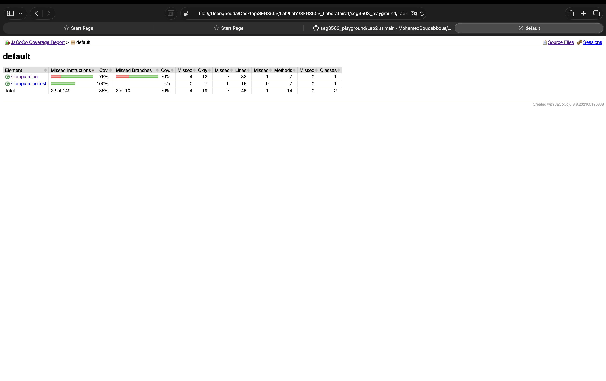
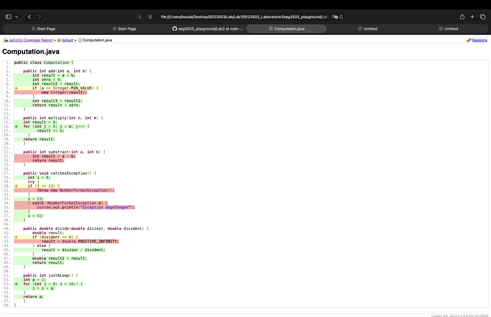
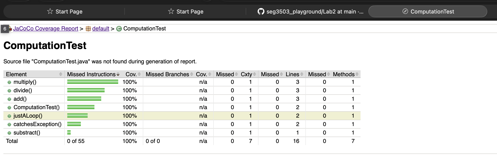

## Analyse des résultats dans le navigateur

Après avoir exécuté les tests JUnit avec JaCoCo, j’ai généré le rapport de couverture et je l’ai ouvert dans le navigateur avec le fichier `report/index.html`. Cette étape permet d’observer visuellement quelles parties du code ont été exécutées par les tests et quelles parties restent non couvertes.

Le rapport global montre une couverture des instructions de 85%, avec 22 instructions manquées sur 149. La couverture des branches est de 70%, avec 3 branches manquées sur 10. Cela indique que les tests existants couvrent une grande partie du code, mais qu’il reste encore certains chemins conditionnels qui ne sont pas entièrement testés.

Dans la vue du package default, on peut distinguer deux éléments principaux : Computation et ComputationTest. La classe Computation atteint une couverture des instructions de 76%, tandis que ComputationTest atteint 100%. Le total reste donc à 85%, car les tests sont entièrement exécutés, mais la classe principale contient encore du code non couvert.

Dans la vue détaillée de la classe Computation, certaines méthodes sont bien couvertes, comme multiply, justALoop et le constructeur Computation, qui atteignent 100%. Cependant, d’autres méthodes restent partiellement couvertes. Par exemple, add atteint 77%, divide atteint 80%, catchesException atteint 57%, et subtract apparaît à 0%. Cela montre que les tests actuels ne couvrent pas toutes les instructions et toutes les branches de la classe.

L’analyse du fichier Computation.java confirme ces résultats. Les lignes vertes représentent le code exécuté par les tests, tandis que les lignes rouges montrent le code non exécuté. On remarque notamment que certaines branches conditionnelles ne sont pas couvertes, par exemple dans add, catchesException et divide. Cela explique pourquoi la couverture des branches reste à 70%.

Enfin, la vue de ComputationTest montre une couverture de 100% pour les méthodes de test. Cela signifie que tous les tests ont bien été exécutés. Cependant, cela ne veut pas dire que le code testé est entièrement couvert. Les tests passent correctement, mais ils ne vérifient pas encore tous les chemins possibles dans la classe Computation.