# SEG3503 Lab 04

Group 12: 
Mohamed Boudabbous 300376202
Wissam Elmasry

## Analyse des résultats dans le navigateur

Après avoir exécuté les tests JUnit avec JaCoCo, j’ai généré le rapport de couverture et je l’ai ouvert dans le navigateur avec le fichier `report/index.html`. Cette étape permet d’observer visuellement quelles parties du code ont été exécutées par les tests et quelles parties restent non couvertes.

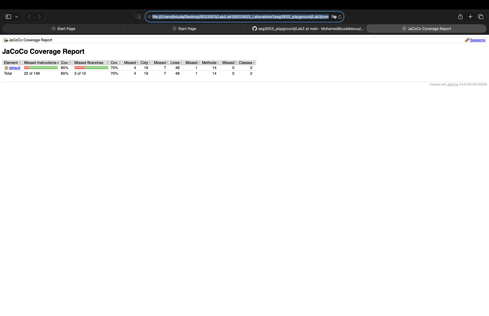

Le rapport global montre une couverture des instructions de 85%, avec 22 instructions manquées sur 149. La couverture des branches est de 70%, avec 3 branches manquées sur 10. Cela indique que les tests existants couvrent une grande partie du code, mais qu’il reste encore certains chemins conditionnels qui ne sont pas entièrement testés.

Dans la vue du package default, on peut distinguer deux éléments principaux : Computation et ComputationTest. La classe Computation atteint une couverture des instructions de 76%, tandis que ComputationTest atteint 100%. Le total reste donc à 85%, car les tests sont entièrement exécutés, mais la classe principale contient encore du code non couvert.

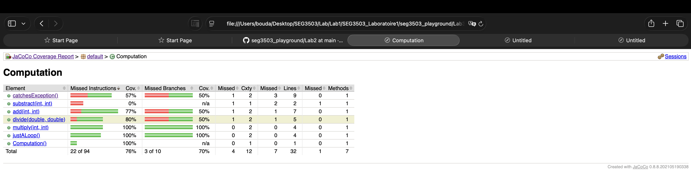

Dans la vue détaillée de la classe Computation, certaines méthodes sont bien couvertes, comme multiply, justALoop et le constructeur Computation, qui atteignent 100%. Cependant, d’autres méthodes restent partiellement couvertes. Par exemple, add atteint 77%, divide atteint 80%, catchesException atteint 57%, et subtract apparaît à 0%. Cela montre que les tests actuels ne couvrent pas toutes les instructions et toutes les branches de la classe.

L’analyse du fichier Computation.java confirme ces résultats. Les lignes vertes représentent le code exécuté par les tests, tandis que les lignes rouges montrent le code non exécuté. On remarque notamment que certaines branches conditionnelles ne sont pas couvertes, par exemple dans add, catchesException et divide. Cela explique pourquoi la couverture des branches reste à 70%.

Enfin, la vue de ComputationTest montre une couverture de 100% pour les méthodes de test. Cela signifie que tous les tests ont bien été exécutés. Cependant, cela ne veut pas dire que le code testé est entièrement couvert. Les tests passent correctement, mais ils ne vérifient pas encore tous les chemins possibles dans la classe Computation.

## Refactoring de la classe Computation

Après l’analyse initiale du rapport JaCoCo, j’ai effectué le refactoring de la classe `Computation`. L’objectif était de nettoyer le code sans modifier le comportement attendu par les tests. Le refactoring a été réalisé progressivement, méthode par méthode, afin de pouvoir relancer les tests JUnit après chaque modification et vérifier que le programme restait correct.

### Refactoring de la méthode add

Avant le refactoring, la méthode `add` contenait plusieurs variables temporaires inutiles, notamment `zero`, `result2` et `result3`. Elle contenait aussi une condition spéciale sur `Integer.MIN_VALUE` avec une instruction qui ne changeait pas le résultat final de la méthode. Cette partie rendait le code plus long et moins clair sans apporter de fonctionnalité utile.

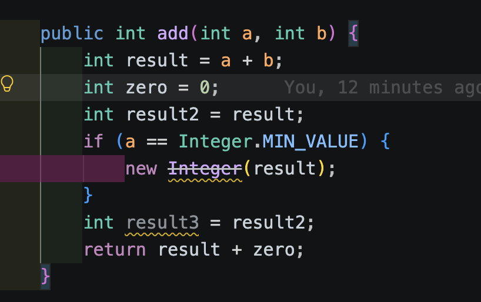

Après le refactoring, la méthode a été simplifiée pour retourner directement la somme des deux paramètres. Le comportement reste le même, mais le code devient beaucoup plus court, plus lisible et plus facile à maintenir.

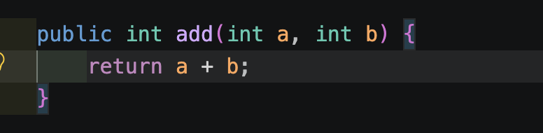

### Refactoring de la méthode multiply

Avant le refactoring, la méthode `multiply` calculait la multiplication à l’aide d’une boucle et d’additions répétées. Cette version fonctionnait, mais elle était plus longue que nécessaire pour une opération simple de multiplication.

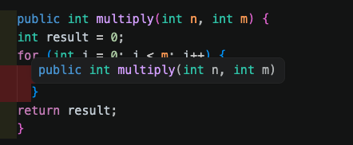

Après le refactoring, j’ai choisi une version plus agressive en utilisant directement l’opérateur de multiplication. Cette modification simplifie fortement la méthode, réduit le nombre d’instructions et rend l’intention du code immédiatement compréhensible.

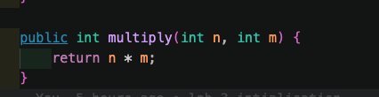

### Refactoring de la méthode substract

Avant le refactoring, la méthode `substract` utilisait une variable locale uniquement pour stocker le résultat de la soustraction avant de le retourner. Cette variable intermédiaire n’était pas nécessaire.

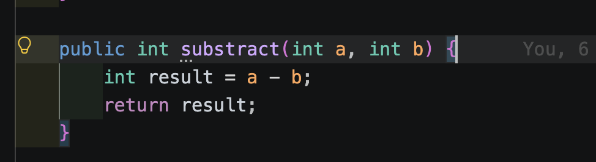

Après le refactoring, la méthode retourne directement le résultat de la soustraction. Le comportement reste identique, mais le code devient plus direct et plus propre.

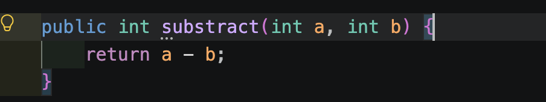

### Refactoring de la méthode catchesException

Avant le refactoring, la méthode `catchesException` contenait une structure `try/catch`. Cependant, la condition qui déclenchait l’exception ne pouvait jamais être vraie, car la variable utilisée était initialisée à une valeur différente juste avant. Le bloc d’exception était donc du code mort dans l’exécution normale de la méthode.

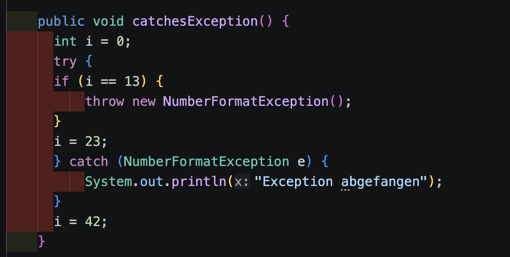

Après le refactoring, ce code inutile a été supprimé. La méthode ne produisait aucun résultat utile et ne retournait aucune valeur, donc elle a été simplifiée. Cette modification rend le code plus clair et supprime une branche impossible à atteindre.

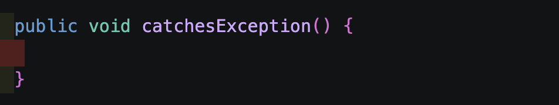

### Refactoring de la méthode divide

Avant le refactoring, la méthode `divide` utilisait une variable temporaire pour stocker le résultat, puis une autre variable qui n’était pas utilisée. Ces variables rendaient le code plus long sans changer le comportement de la méthode.

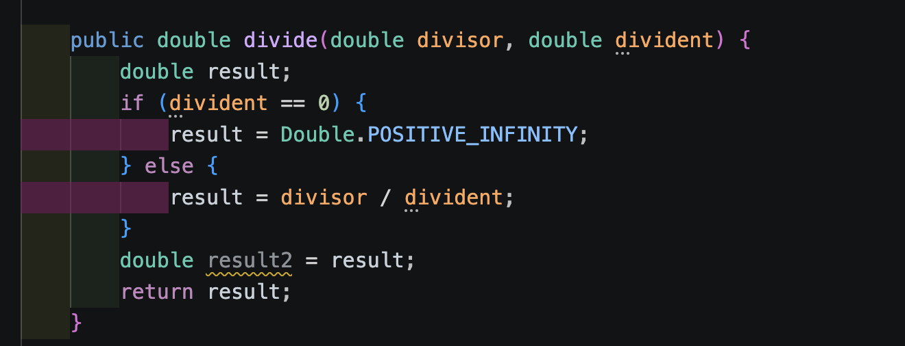

Après le refactoring, la méthode retourne directement le résultat selon le cas rencontré. Si le diviseur est égal à zéro, elle retourne directement l’infini positif. Sinon, elle retourne directement le résultat de la division. Cette version est plus lisible et élimine les variables inutiles.

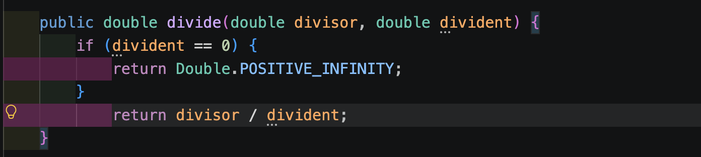

### Refactoring de la méthode justALoop

Avant le refactoring, la méthode `justALoop` contenait une boucle qui modifiait seulement une variable locale. Cependant, cette boucle n’avait aucun effet sur la valeur retournée, puisque la méthode retournait toujours la même valeur.

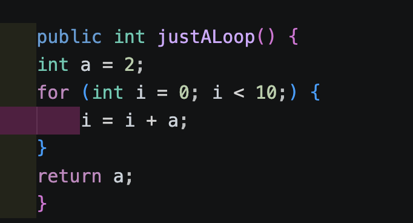

Après le refactoring, la méthode retourne directement la valeur attendue. Cette modification supprime une boucle inutile et rend le comportement de la méthode immédiatement compréhensible.

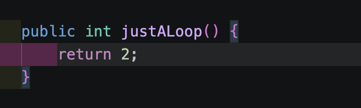

### Résultat du refactoring

Le refactoring de `Computation` a permis de supprimer plusieurs éléments inutiles : variables temporaires, code mort, conditions impossibles, boucle inutile et instructions non nécessaires. Après chaque modification, les tests JUnit ont été relancés afin de vérifier que le comportement attendu était toujours conservé.

Globalement, la classe `Computation` est maintenant plus courte, plus lisible et plus facile à maintenir. Le refactoring a aussi eu un effet positif sur la couverture JaCoCo, car le nombre total d’instructions à couvrir a diminué. La couverture globale est passée de 85% avant refactoring à 92% après refactoring, sans ajout de nouveaux tests.

## Analyse des résultats après refactoring de Computation

Après avoir terminé le refactoring de la classe `Computation`, j’ai recompilé le projet, relancé tous les tests JUnit, puis généré un nouveau rapport JaCoCo. Les tests continuent de passer avec succès, ce qui confirme que les modifications effectuées n’ont pas changé le comportement attendu du programme. Le refactoring avait principalement pour objectif de simplifier le code, de supprimer les variables inutiles, d’éliminer du code mort et de rendre les méthodes plus directes.

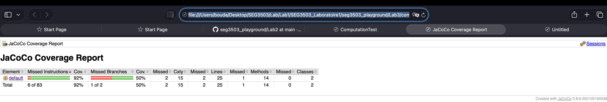

Le rapport global après refactoring montre une couverture des instructions de 92%, avec seulement 6 instructions manquées sur 83. Avant le refactoring, la couverture globale était de 85%, avec 22 instructions manquées sur 149. On remarque donc une amélioration de la couverture globale. Cette amélioration ne vient pas de l’ajout de nouveaux tests, mais plutôt de la réduction du nombre total d’instructions à couvrir. En supprimant les lignes inutiles, les variables temporaires et certaines structures non nécessaires, le code devient plus simple et plus facile à couvrir par les tests existants.

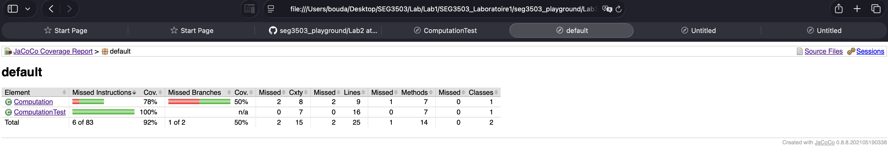

Dans la vue du package `default`, la classe `Computation` atteint maintenant 78% de couverture des instructions, alors qu’elle était à 76% avant le refactoring. La classe `ComputationTest` reste à 100%, ce qui indique que toutes les méthodes de test sont bien exécutées. Le total global augmente donc principalement parce que la classe principale contient moins de code inutile qu’avant. Même si l’augmentation de la couverture de `Computation` est légère, le code est maintenant plus clair, plus court et plus facile à maintenir.

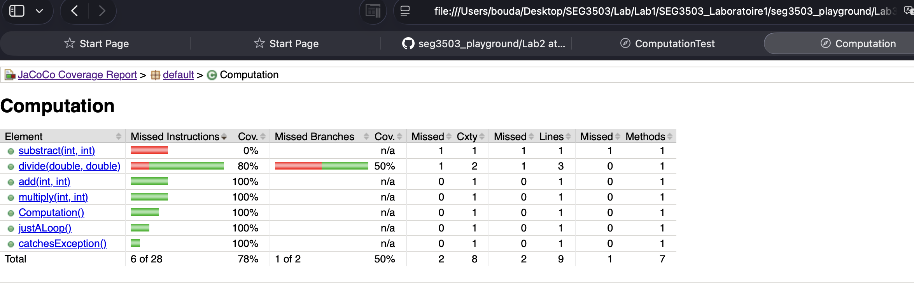

La vue détaillée de la classe `Computation` montre plus clairement l’effet du refactoring sur chaque méthode. Plusieurs méthodes atteignent maintenant une couverture de 100%, notamment `add`, `multiply`, `catchesException`, `justALoop` et le constructeur `Computation`. La méthode `multiply` a été simplifiée de manière agressive : au lieu d’effectuer une multiplication par additions répétées dans une boucle, elle utilise directement l’opérateur de multiplication. De la même manière, `justALoop` a été simplifiée, car la boucle ne modifiait pas la valeur retournée. Ces changements réduisent la complexité du code tout en conservant le résultat attendu.

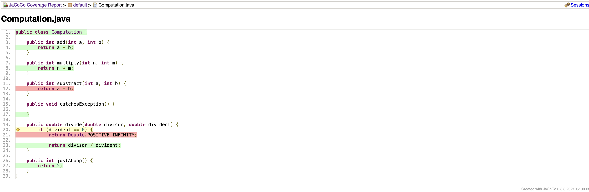

L’analyse du fichier `Computation.java` après refactoring confirme visuellement cette amélioration. La majorité du code apparaît maintenant en vert, ce qui signifie qu’il est exécuté par les tests. Les anciennes lignes inutiles, comme les variables temporaires dans `add`, la variable inutilisée dans `divide`, ou encore la boucle inutile dans `justALoop`, ont été supprimées. Le code source est donc plus lisible et contient moins d’éléments non couverts. Cependant, certaines limites restent visibles : la méthode `divide` garde une branche non couverte, car les tests ne semblent pas couvrir tous les cas possibles de la condition sur le diviseur. De plus, `substract` apparaît encore comme non couverte dans la vue de `Computation`, ce qui montre qu’il reste un point à vérifier ou à améliorer dans la suite de tests.

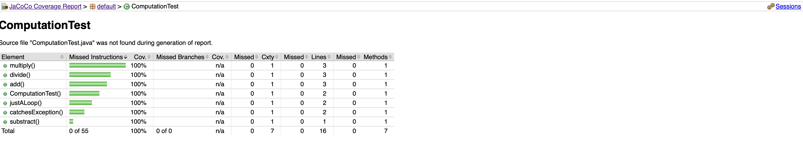

La vue de `ComputationTest` montre une couverture de 100% pour les méthodes de test. Cela signifie que tous les tests ont bien été exécutés après le refactoring. Cependant, cette couverture complète du fichier de test ne signifie pas automatiquement que la classe `Computation` est entièrement couverte. Elle indique seulement que les tests eux-mêmes ont tous été exécutés. Pour atteindre une meilleure couverture de la classe principale, il faudrait ajouter ou ajuster certains tests afin de couvrir les branches restantes, notamment dans `divide`, et vérifier pourquoi `substract` n’est pas comptabilisée comme couverte dans le rapport.

En conclusion, le refactoring de `Computation` a amélioré la qualité du code et la couverture globale du projet. La couverture des instructions est passée de 85% à 92%, principalement grâce à la suppression du code inutile. Le comportement du programme reste valide puisque tous les tests JUnit passent encore après les modifications. Cette étape montre donc qu’un refactoring peut améliorer la lisibilité et la maintenabilité du code, tout en influençant positivement les résultats de couverture.

## Analyse des résultats avant refactoring de Date

Avant de modifier la classe `Date`, j’ai d’abord exécuté les tests JUnit existants puis généré un rapport JaCoCo afin d’observer la couverture initiale du projet. Cette étape permet d’identifier les méthodes déjà bien couvertes par les tests, ainsi que les parties du code qui nécessitent des tests supplémentaires avant la refactorisation.

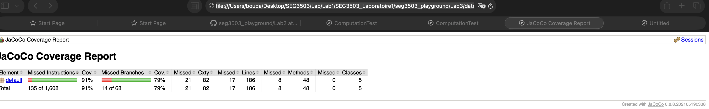

Le rapport global indique une couverture des instructions de 91%, avec 135 instructions manquées sur 1608. La couverture des branches est de 79%, avec 14 branches manquées sur 68. Ces résultats montrent que les tests existants couvrent déjà une grande partie du projet, mais qu’il reste encore plusieurs chemins conditionnels non couverts. La couverture des lignes est aussi assez élevée, avec 17 lignes manquées sur 186, mais elle n’est pas complète. Cela signifie que le code est globalement bien testé, mais que certaines conditions particulières dans `Date.java` ne sont pas encore vérifiées.

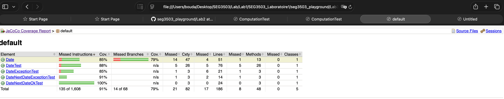

Dans la vue du package `default`, on peut voir que la classe principale `Date` atteint 85% de couverture des instructions et 79% de couverture des branches. Les classes de tests ont aussi été exécutées : `DateTest` atteint 88%, `DateExceptionTest` atteint 85%, `DateNextDateExceptionTest` atteint 91%, et `DateNextDateOkTest` atteint 100%. Cette vue montre donc que les tests existants sont bien présents et exécutés, mais que la classe `Date` elle-même contient encore plusieurs parties non couvertes.

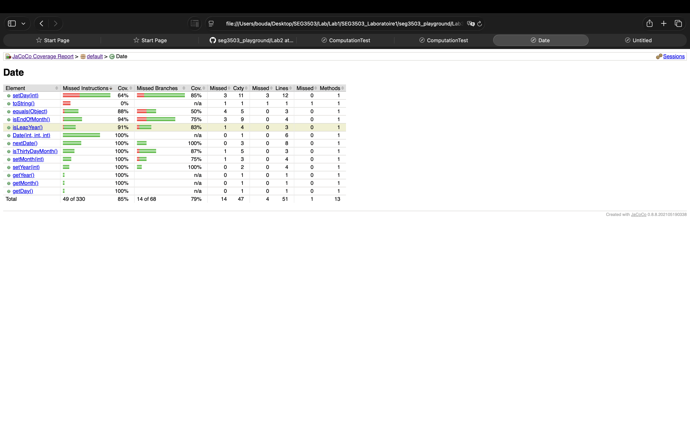

Dans la vue détaillée de `Date`, certaines méthodes sont déjà très bien couvertes. Le constructeur `Date(int, int, int)`, `nextDate()`, `setYear(int)`, `getYear()`, `getMonth()` et `getDay()` atteignent 100% de couverture des instructions. Cependant, d’autres méthodes restent partiellement couvertes ou non couvertes. Par exemple, `setDay(int)` atteint seulement 64%, `setMonth(int)` atteint 91%, `isEndOfMonth()` atteint 94%, `isLeapYear()` atteint 91%, `equals(Object)` atteint 88%, et `toString()` est à 0%. Cela montre que les tests existants couvrent surtout les cas principaux, mais pas tous les cas limites.

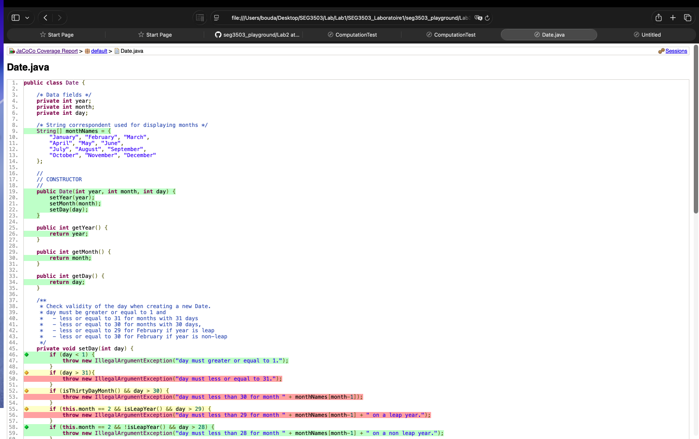

L’analyse visuelle du fichier `Date.java` confirme ces résultats. Dans la première partie du fichier, plusieurs lignes liées à la validation du jour ne sont pas couvertes. Les lignes rouges apparaissent notamment dans les cas d’erreur où une exception doit être lancée. Par exemple, certains cas invalides liés aux jours supérieurs à 31, aux mois de 30 jours, ou encore au mois de février ne sont pas tous exécutés par les tests actuels. Les zones jaunes indiquent aussi que certaines conditions composées ne sont couvertes que partiellement.

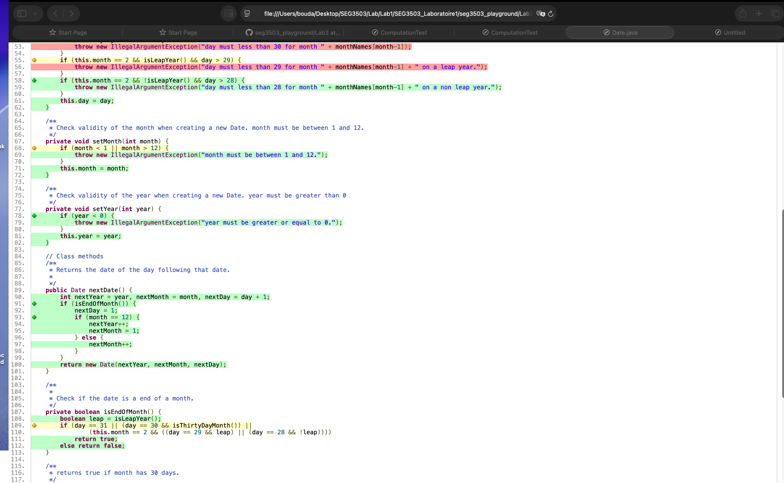

Dans la deuxième partie de `Date.java`, on voit que les méthodes liées à la validation du mois, de l’année et au calcul de la date suivante sont mieux couvertes. La méthode `nextDate()` apparaît principalement en vert, ce qui signifie que les tests existants couvrent déjà les principaux scénarios de passage au jour suivant, au mois suivant et à l’année suivante. Cependant, certaines conditions restent partiellement couvertes, notamment dans `isEndOfMonth()`, où plusieurs cas dépendent de combinaisons entre le jour, le mois et l’année bissextile.

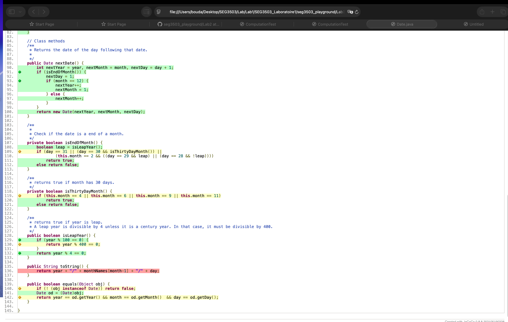

Dans la dernière partie du fichier, les méthodes `isThirtyDayMonth()`, `isLeapYear()`, `toString()` et `equals(Object)` montrent encore des limites de couverture. La méthode `isLeapYear()` est presque entièrement couverte, mais certaines branches restent partielles. La méthode `toString()` apparaît en rouge, ce qui indique qu’elle n’est pas testée. La méthode `equals(Object)` est seulement partiellement couverte, car certains cas comme la comparaison avec un objet qui n’est pas une date ou la comparaison de deux dates différentes ne semblent pas tous être testés.

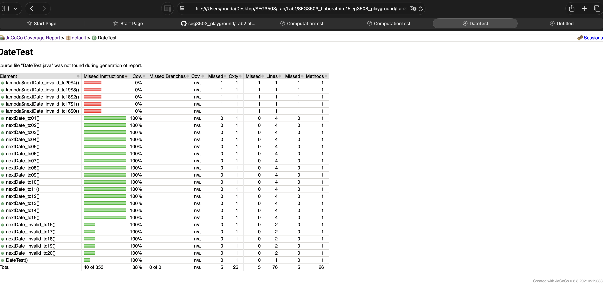

La classe `DateTest` est couverte à 88%, ce qui montre que la majorité des tests unitaires généraux sont exécutés. Cependant, certaines méthodes de test ou certaines lignes dans le fichier de test ne sont pas entièrement couvertes. Cela n’est pas le point principal du laboratoire, car l’objectif est surtout d’améliorer la couverture du code source dans `Date.java`, mais cette information confirme que les tests existants ne couvrent pas encore tous les scénarios possibles.

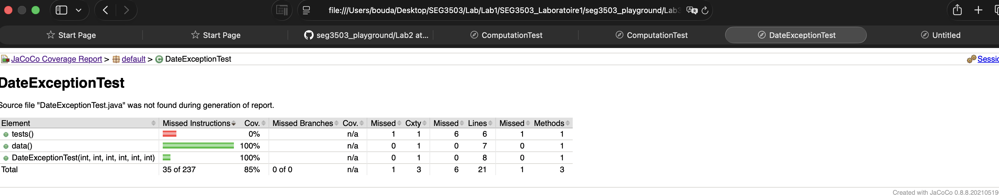

La classe `DateExceptionTest` atteint 85% de couverture. Elle teste déjà plusieurs cas invalides, mais les lignes rouges dans `Date.java` montrent que certains cas d’exception ne sont pas encore déclenchés par les tests actuels. Il faudra donc ajouter de nouveaux tests pour couvrir davantage les validations du jour et du mois.

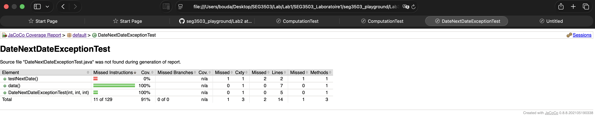

La classe `DateNextDateExceptionTest` atteint 91% de couverture. Cette classe semble couvrir certains cas liés aux exceptions lors de la création ou de la manipulation de dates invalides. Malgré cela, elle ne suffit pas encore à couvrir toutes les branches conditionnelles de `Date.java`.

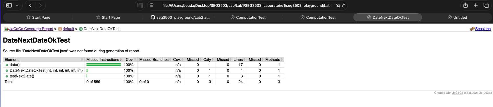

Enfin, `DateNextDateOkTest` atteint 100% de couverture. Cela indique que les tests liés aux dates valides et au calcul de la date suivante sont bien exécutés. Cependant, une couverture complète de cette classe de test ne signifie pas que toute la classe `Date` est entièrement couverte. Le rapport montre encore plusieurs branches manquées dans `Date.java`, surtout dans les méthodes de validation et de comparaison.

En conclusion, avant toute modification ou refactorisation de `Date.java`, la couverture est déjà élevée, mais elle n’est pas complète. Les résultats montrent que les tests existants couvrent bien les scénarios standards, notamment la création de dates valides et le calcul de la date suivante. Toutefois, plusieurs cas limites restent à ajouter, notamment pour `setDay(int)`, `isEndOfMonth()`, `isThirtyDayMonth()`, `toString()` et `equals(Object)`. La prochaine étape sera donc d’ajouter des tests ciblés afin d’améliorer la couverture des instructions, des branches et des conditions avant de commencer le refactoring de `Date.java`.

## Tests rajoutés pour Date

Après l’analyse du premier rapport JaCoCo de la classe `Date`, j’ai ajouté plusieurs tests dans `DateTest.java` afin de couvrir les parties du code qui étaient encore non exécutées ou partiellement couvertes. Les tests ajoutés ciblent principalement les cas limites de validation des jours, les années bissextiles, la méthode `toString()` et la méthode `equals(Object)`.

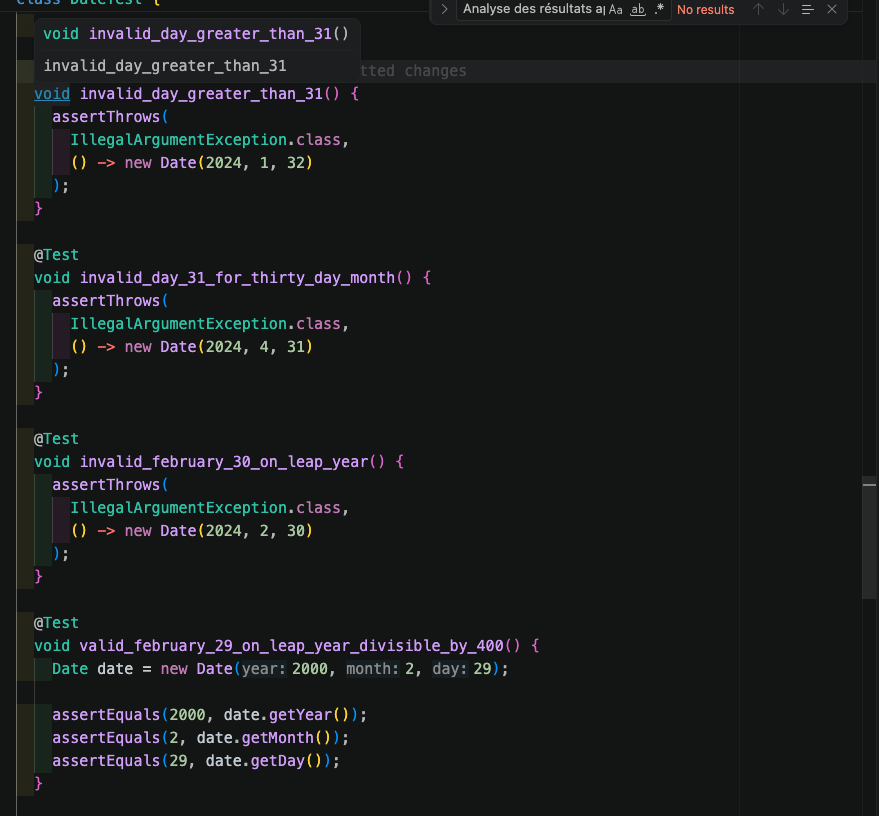

La première série de tests ajoutés concerne la validation des jours invalides. Le test `invalid_day_greater_than_31` vérifie qu’une exception est lancée lorsqu’un jour supérieur à 31 est utilisé. Le test `invalid_day_31_for_thirty_day_month` vérifie le cas d’un jour 31 dans un mois qui contient seulement 30 jours, comme avril. Le test `invalid_february_30_on_leap_year` couvre le cas de février 30 pendant une année bissextile, ce qui reste invalide. Ces tests permettent de mieux couvrir la méthode `setDay(int)`, qui était l’une des méthodes les moins couvertes dans le rapport initial.

La première série contient aussi le test `valid_february_29_on_leap_year_divisible_by_400`. Ce test vérifie qu’une date comme le 29 février 2000 est acceptée, car 2000 est divisible par 400 et correspond donc à une année bissextile. Ce test permet de couvrir un cas important de la méthode `isLeapYear()`.

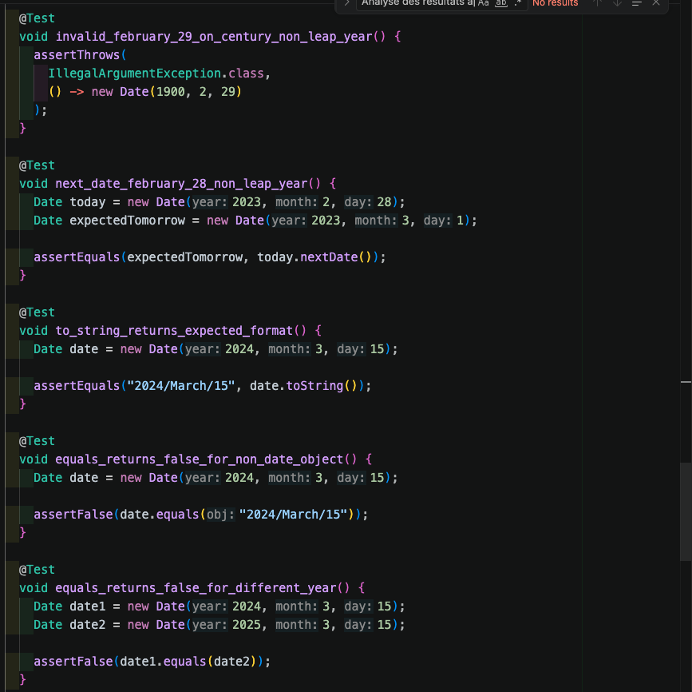

La deuxième série de tests vise d’autres cas limites. Le test `invalid_february_29_on_century_non_leap_year` vérifie que le 29 février 1900 est refusé, car 1900 est divisible par 100 mais pas par 400. Ce cas est important pour couvrir correctement la logique des années bissextiles.

Le test `next_date_february_28_non_leap_year` vérifie que le jour suivant le 28 février 2023 est bien le 1er mars 2023. Ce test améliore la couverture des conditions dans `isEndOfMonth()` et de la logique de `nextDate()`.

Le test `to_string_returns_expected_format` vérifie que la méthode `toString()` retourne bien une chaîne au format attendu, par exemple `2024/March/15`. Avant l’ajout de ce test, la méthode `toString()` n’était pas couverte dans le rapport JaCoCo.

Le test `equals_returns_false_for_non_date_object` vérifie que la méthode `equals(Object)` retourne `false` lorsqu’on compare une date avec un objet qui n’est pas une instance de `Date`. Cela permet de couvrir la première condition de la méthode `equals`.

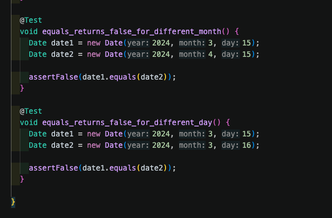

La troisième série de tests complète la couverture de `equals(Object)`. Les tests `equals_returns_false_for_different_year`, `equals_returns_false_for_different_month` et `equals_returns_false_for_different_day` vérifient que deux dates sont considérées différentes si elles n’ont pas la même année, le même mois ou le même jour. Ces tests permettent de couvrir plusieurs chemins logiques dans la condition finale de `equals`.

Globalement, les tests ajoutés ont permis de couvrir plusieurs cas qui n’étaient pas vérifiés par la suite initiale. Ils améliorent surtout la couverture des méthodes `setDay(int)`, `isLeapYear()`, `isEndOfMonth()`, `toString()` et `equals(Object)`. Après leur ajout, la couverture de la classe `Date` est passée à 100% pour les instructions, et la couverture des branches a fortement augmenté. Cela montre que les nouveaux tests ciblent bien les parties faibles du code identifiées dans le rapport JaCoCo initial.

## Analyse des résultats après ajout de tests pour Date

Après avoir analysé la couverture initiale de `Date.java`, j’ai ajouté plusieurs tests ciblés dans `DateTest.java`. L’objectif était de couvrir les parties qui apparaissaient en rouge ou en jaune dans le rapport JaCoCo, notamment les validations de jours invalides, certains cas particuliers d’années bissextiles, la méthode `toString()` et plusieurs scénarios de comparaison avec `equals(Object)`. Après l’ajout de ces tests, j’ai recompilé le projet, relancé tous les tests JUnit, puis généré un nouveau rapport JaCoCo.

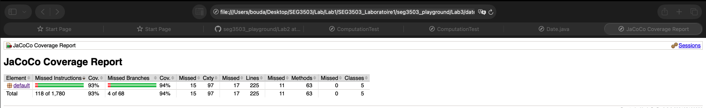

Le rapport global montre maintenant une couverture des instructions de 93%, avec 118 instructions manquées sur 1780. Avant l’ajout des tests, la couverture globale était de 91%, avec 135 instructions manquées sur 1608. La couverture des branches est passée de 79% à 94%, avec seulement 4 branches manquées sur 68 après l’ajout des tests. Cette amélioration est importante, car elle montre que les nouveaux tests ont surtout permis de mieux couvrir les chemins conditionnels du programme. Même si le nombre total d’instructions a augmenté, parce que le fichier de test contient maintenant plus de méthodes, le nombre d’instructions non couvertes a diminué.

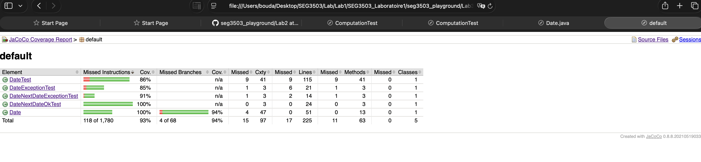

Dans la vue du package `default`, la classe `Date` atteint maintenant 100% de couverture des instructions, alors qu’elle était à 85% avant l’ajout des tests. Sa couverture des branches atteint maintenant 94%, alors qu’elle était auparavant à 79%. Cela montre que les tests ajoutés ont bien amélioré la couverture du code source principal. Les classes de tests restent aussi bien exécutées : `DateNextDateOkTest` reste à 100%, `DateNextDateExceptionTest` reste à 91%, `DateExceptionTest` reste à 85%, et `DateTest` atteint maintenant 86%. La légère baisse apparente de `DateTest` n’est pas un problème central, car l’objectif du laboratoire est surtout d’améliorer la couverture de la classe testée, c’est-à-dire `Date`.

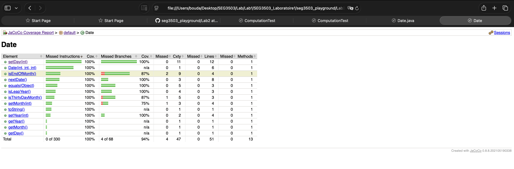

La vue détaillée de la classe `Date` confirme l’amélioration principale : toutes les méthodes atteignent maintenant 100% de couverture des instructions. Les méthodes qui étaient faibles avant l’ajout des tests, comme `setDay(int)`, `toString()`, `equals(Object)`, `isLeapYear()` et `isEndOfMonth()`, sont maintenant exécutées par les tests. Par exemple, les nouveaux tests couvrent des cas comme un jour supérieur à 31, un jour 31 dans un mois de 30 jours, février 30 dans une année bissextile, février 29 dans une année séculaire non bissextile, ainsi que l’affichage d’une date avec `toString()` et plusieurs comparaisons avec `equals(Object)`.

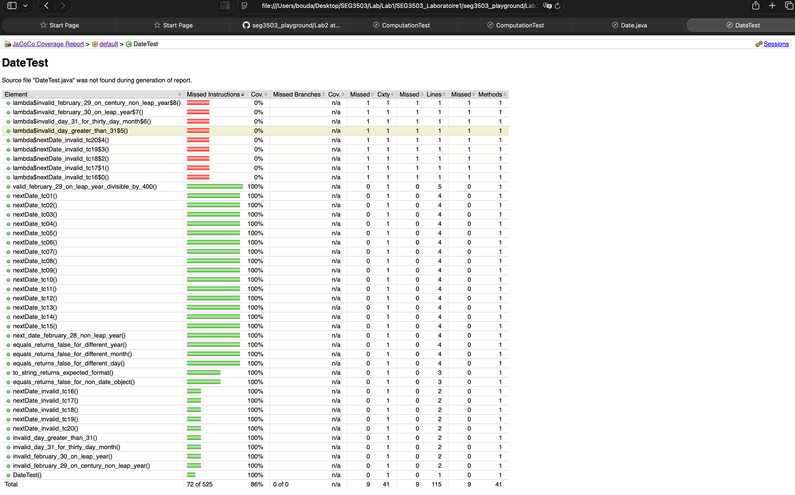

La vue de `DateTest` montre que plusieurs nouvelles méthodes de test ont bien été ajoutées et exécutées. Certaines lignes liées aux expressions lambda utilisées dans `assertThrows` apparaissent cependant à 0% dans le rapport. Cela vient du fait que JaCoCo affiche séparément certaines fonctions générées pour les lambdas. Même si ces lignes apparaissent dans le rapport de la classe de test, cela ne signifie pas que les tests sont inutiles : les effets sont bien visibles sur la classe `Date`, dont la couverture des instructions est passée à 100%.

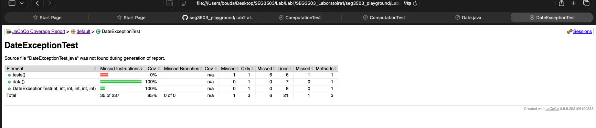

La classe `DateExceptionTest` reste à 85%. Elle n’a pas été modifiée directement, donc sa couverture ne change pas de façon importante. Elle continue toutefois à couvrir certains cas invalides déjà présents dans la suite de tests initiale.

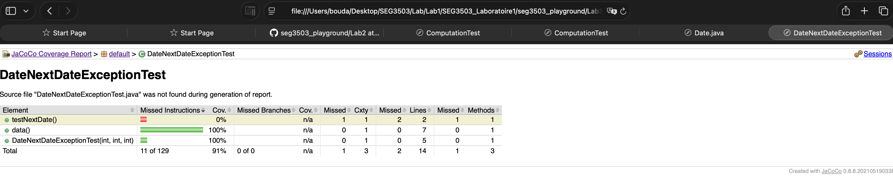

La classe `DateNextDateExceptionTest` reste à 91%. Cette classe continue de valider plusieurs cas d’exception lors de la création de dates invalides. Les nouveaux tests ajoutés dans `DateTest` complètent ces tests existants en visant des branches qui n’étaient pas encore entièrement couvertes dans `Date.java`.

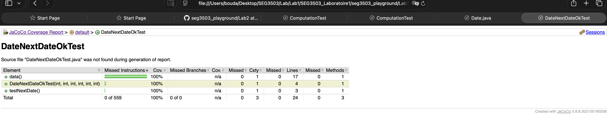

La classe `DateNextDateOkTest` reste à 100%. Elle couvre déjà très bien les scénarios valides liés à `nextDate()`, comme le passage au jour suivant, au mois suivant et à l’année suivante. Les nouveaux tests ne modifient pas cette classe, mais ils complètent la couverture générale du projet en ajoutant des cas de validation, d’affichage et de comparaison.

En conclusion, l’ajout de tests a fortement amélioré la couverture de `Date.java`. La couverture des instructions de la classe `Date` est passée de 85% à 100%, et la couverture des branches est passée de 79% à 94%. Le rapport montre donc que les nouveaux tests ont été utiles, surtout pour couvrir les cas limites et les chemins conditionnels. Cependant, une couverture de branches de 100% n’est pas encore atteinte : il reste 4 branches manquées sur 68. Cela indique que certains chemins logiques très précis, probablement liés à des conditions composées dans les méthodes privées comme `isEndOfMonth()` ou `isThirtyDayMonth()`, restent difficiles à couvrir entièrement sans ajouter encore plus de cas ciblés. Cette étape montre donc que les tests ajoutés améliorent fortement la couverture, mais qu’atteindre 100% partout n’est pas automatiquement garanti.

## Refactoring de la classe Date

Après avoir ajouté des tests pour améliorer la couverture de `Date.java`, j’ai commencé le refactoring de la classe `Date`. L’objectif était de simplifier le code, de réduire la duplication et d’améliorer la lisibilité, sans modifier le comportement attendu. Après chaque changement, les tests JUnit ont été relancés afin de vérifier que la classe fonctionnait toujours correctement.

### Refactoring de la méthode isThirtyDayMonth

Avant le refactoring, la méthode `isThirtyDayMonth` utilisait une structure `if/else` pour retourner `true` ou `false`. Cette structure était inutile, car la condition elle-même produit déjà une valeur booléenne.

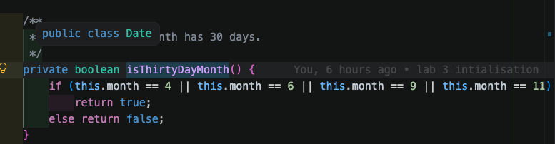

Après le refactoring, la méthode retourne directement le résultat de la condition. Le comportement reste identique, mais le code devient plus court et plus clair.

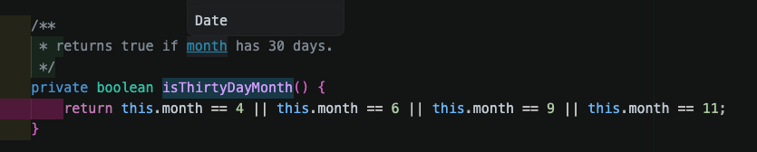

### Refactoring de la méthode isEndOfMonth

Avant le refactoring, la méthode `isEndOfMonth` utilisait aussi une structure `if/else` pour retourner `true` ou `false`. La condition était longue, mais le `if/else` n’était pas nécessaire puisque le résultat de cette condition pouvait être retourné directement.

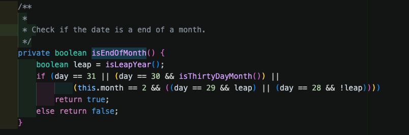

Après le refactoring, la méthode retourne directement la condition. La variable `leap` est conservée pour éviter de rappeler plusieurs fois `isLeapYear()` et pour garder la condition plus lisible. Cette modification garde la même logique tout en simplifiant la structure de la méthode.

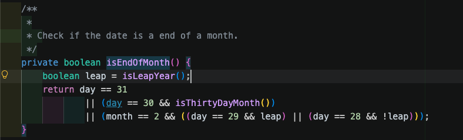

### Refactoring de la méthode nextDate

Avant le refactoring, la méthode `nextDate` déclarait plusieurs variables sur une seule ligne. Même si le code fonctionnait, cette écriture rendait la lecture moins claire, surtout parce que `nextYear`, `nextMonth` et `nextDay` peuvent ensuite être modifiés selon les cas.

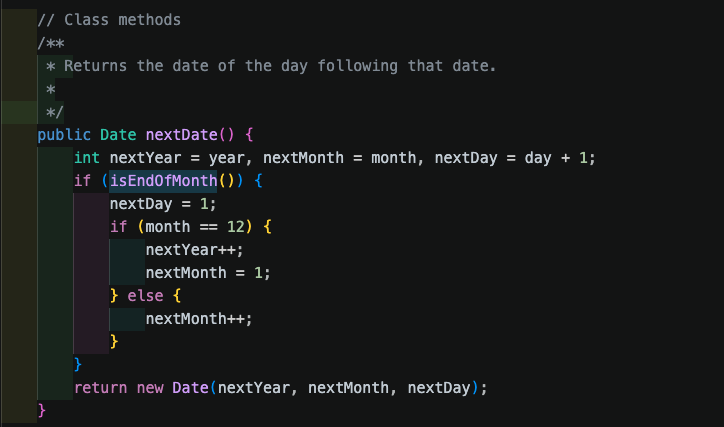

Après le refactoring, chaque variable est déclarée sur une ligne séparée. Cette modification ne change pas le comportement de la méthode, mais elle rend le déroulement de la logique plus facile à suivre, notamment pour les cas de fin de mois et de fin d’année.

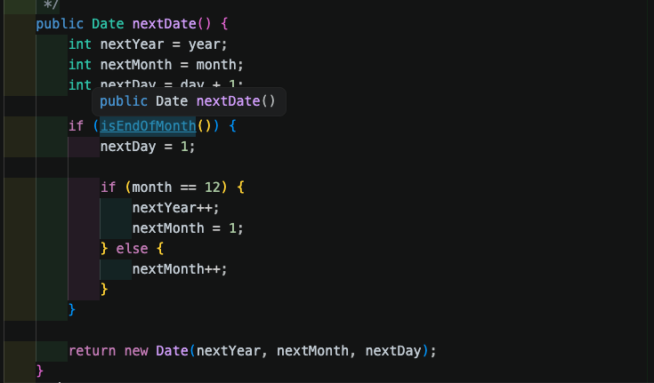

### Refactoring de la méthode setDay

Le refactoring le plus important concerne la méthode `setDay`. Avant le refactoring, cette méthode contenait plusieurs conditions successives pour vérifier les cas particuliers : jour inférieur à 1, jour supérieur à 31, mois de 30 jours, février en année bissextile et février en année non bissextile. Cette version fonctionnait, mais elle mélangeait deux responsabilités : déterminer le nombre maximal de jours du mois et valider la valeur du jour.

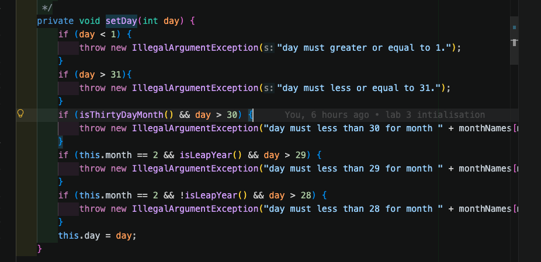

Après le refactoring, la logique a été simplifiée en extrayant une méthode privée `getMaxDayForMonth`. La méthode `setDay` vérifie maintenant seulement si le jour est inférieur à 1, calcule le nombre maximal de jours permis pour le mois courant, puis vérifie si le jour dépasse cette limite. Cette organisation rend le code plus clair, plus court et plus facile à maintenir.

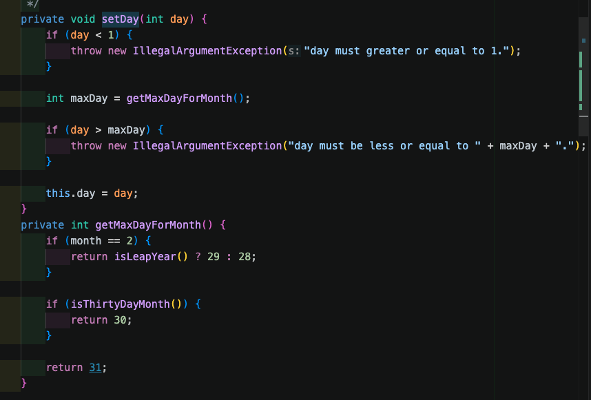

### Refactoring de la méthode equals

Avant le refactoring, la méthode `equals` utilisait une condition sans accolades et un nom de variable peu descriptif. La logique était correcte, mais la lisibilité pouvait être améliorée.

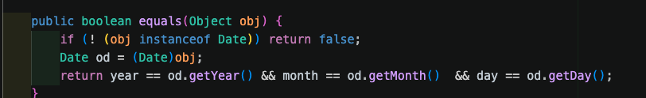

Après le refactoring, des accolades ont été ajoutées et la variable temporaire a été renommée pour rendre le code plus compréhensible. La comparaison reste exactement la même : deux objets `Date` sont considérés égaux seulement si l’année, le mois et le jour sont identiques.

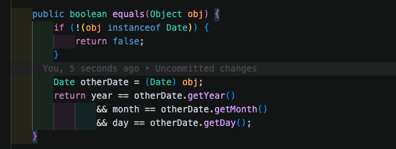

### Refactoring de la méthode toString

La méthode `toString` a seulement été légèrement nettoyée au niveau de l’espacement dans l’accès au tableau `monthNames`. Ce changement est mineur, mais il rend l’écriture plus cohérente avec le reste du fichier.

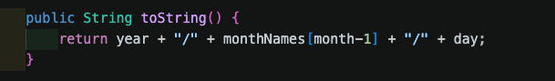

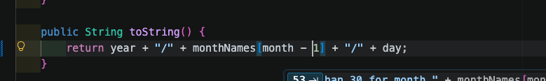

### Résultat du refactoring

Le refactoring de `Date` a principalement amélioré la lisibilité et la structure du code. La méthode `setDay` est devenue plus simple grâce à l’extraction de `getMaxDayForMonth`, tandis que `isThirtyDayMonth` et `isEndOfMonth` ont été simplifiées en retournant directement leurs conditions. Les autres changements sont plus légers, mais ils rendent le code plus cohérent et plus facile à comprendre. Tous les tests ont continué à passer après les modifications, ce qui confirme que le comportement attendu de la classe a été conservé.

## Analyse des résultats après refactoring de Date

Après le refactoring de `Date.java`, j’ai recompilé le projet, relancé tous les tests JUnit, puis généré un nouveau rapport JaCoCo. Le but était de vérifier que les modifications de structure n’avaient pas dégradé le comportement du programme ni la couverture de code.

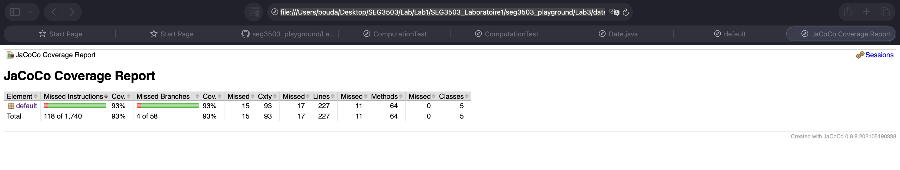

Le rapport global après refactoring indique une couverture des instructions de 93%, avec 118 instructions manquées sur 1740. La couverture des branches est aussi de 93%, avec 4 branches manquées sur 58. Avant le refactoring, après l’ajout des tests, le rapport indiquait déjà une couverture globale de 93%. La couverture globale est donc restée stable, ce qui est cohérent avec l’objectif du refactoring : améliorer la structure du code sans modifier sa logique.

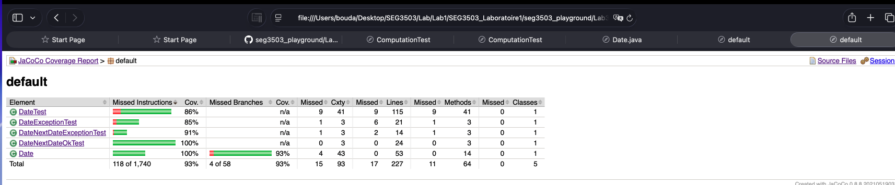

Dans la vue du package `default`, la classe `Date` atteint toujours 100% de couverture des instructions. Cela confirme que le refactoring n’a pas retiré de comportement testé et que les tests ajoutés couvrent encore toutes les instructions de la classe principale. La couverture des branches de `Date` est maintenant de 93%, avec 4 branches manquées sur 58. Les classes de tests conservent aussi des résultats similaires : `DateNextDateOkTest` reste à 100%, `DateNextDateExceptionTest` reste à 91%, `DateExceptionTest` reste à 85%, et `DateTest` reste à 86%.

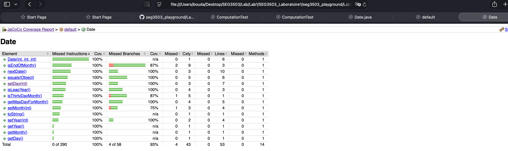

La vue détaillée de la classe `Date` montre que toutes les méthodes ont une couverture des instructions de 100%. Cela inclut le constructeur, les accesseurs, `setDay`, `setMonth`, `setYear`, `nextDate`, `isLeapYear`, `toString` et `equals`. Les méthodes refactorisées restent donc entièrement exécutées par les tests. Les quelques branches manquées se situent surtout dans des conditions composées, notamment dans des méthodes comme `isEndOfMonth`, `isThirtyDayMonth` et `setMonth`.

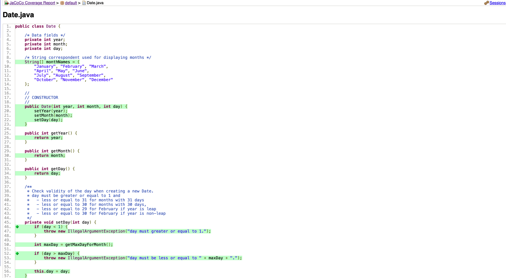

La première partie de `Date.java` montre que le constructeur, les accesseurs et la méthode `setDay` sont bien couverts. Le refactoring de `setDay` a rendu le code plus simple : au lieu de traiter séparément chaque cas particulier dans plusieurs conditions, la méthode utilise maintenant `getMaxDayForMonth` pour déterminer la limite maximale du mois. Cette extraction améliore la lisibilité tout en conservant une couverture complète des instructions.

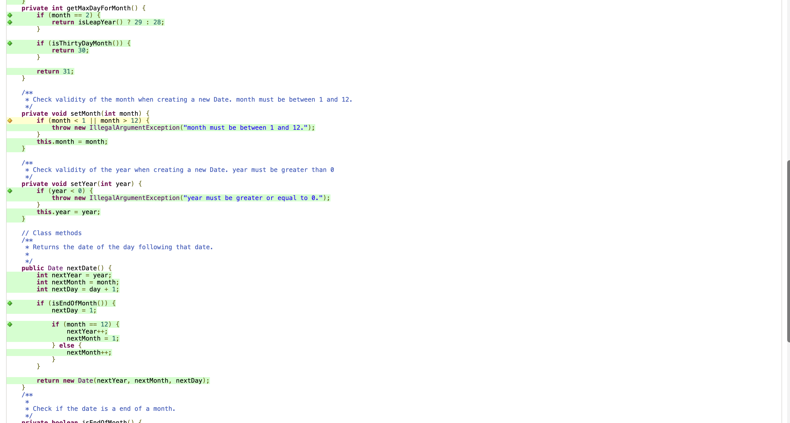

La deuxième partie du fichier montre que `getMaxDayForMonth`, `setMonth`, `setYear` et `nextDate` sont également bien exécutées. La méthode `nextDate` reste couverte après le refactoring, et sa logique est plus lisible grâce à la séparation des variables `nextYear`, `nextMonth` et `nextDay`. Certaines branches restent jaunes, ce qui indique que certaines conditions ne sont pas couvertes dans toutes leurs combinaisons possibles, mais le comportement principal reste bien testé.

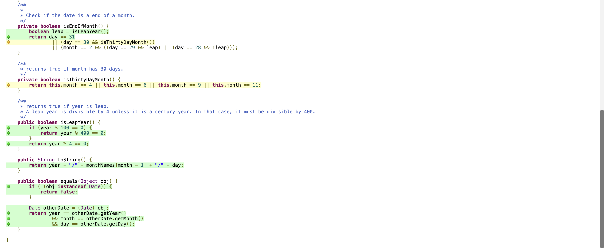

La dernière partie du fichier confirme que `isLeapYear`, `toString` et `equals` sont couvertes. La méthode `equals` est plus lisible après l’ajout d’accolades et le renommage de la variable temporaire. La méthode `toString` reste couverte par les tests ajoutés. Le rapport montre cependant encore des branches partielles dans certaines conditions composées, ce qui explique pourquoi la couverture des branches n’atteint pas 100%.

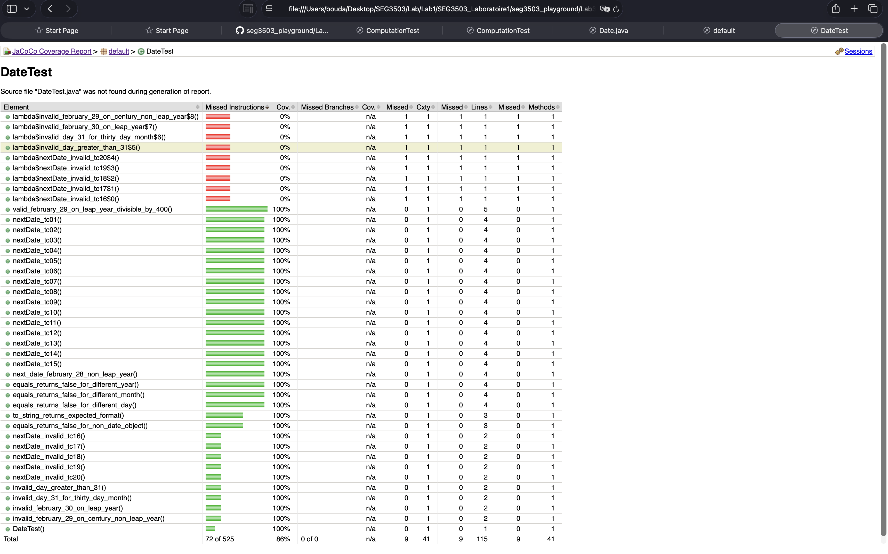

La vue de `DateTest` montre que les nouveaux tests ajoutés sont toujours exécutés après le refactoring. Certains éléments liés aux expressions lambda utilisées avec `assertThrows` apparaissent encore comme non couverts dans le rapport. Cela n’empêche pas la classe `Date` d’être entièrement couverte au niveau des instructions, mais cela explique pourquoi la couverture globale du projet ne monte pas à 100%.

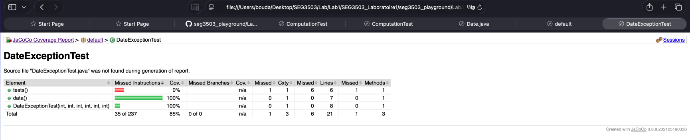

La classe `DateExceptionTest` reste à 85% de couverture. Elle n’a pas été modifiée durant le refactoring, donc son résultat reste cohérent avec les rapports précédents.

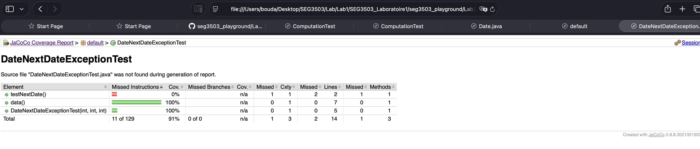

La classe `DateNextDateExceptionTest` reste à 91% de couverture. Elle continue de couvrir plusieurs cas invalides, mais certaines parties du fichier de test ne sont pas entièrement couvertes.

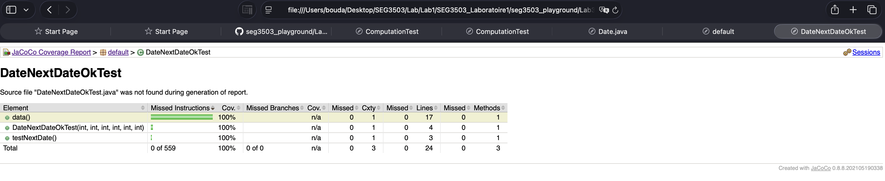

La classe `DateNextDateOkTest` reste à 100% de couverture. Cela confirme que les scénarios valides de calcul de la date suivante continuent à passer après le refactoring.

En conclusion, le refactoring de `Date.java` n’a pas dégradé la couverture. La classe `Date` conserve 100% de couverture des instructions, tandis que la couverture des branches reste élevée à 93%. La couverture globale du projet reste à 93%. Le refactoring a donc surtout amélioré la lisibilité, la structure et la maintenabilité du code, sans modifier son comportement ni réduire l’efficacité des tests.

## Utilisation de Git

Tout au long du laboratoire, j’ai utilisé Git afin de sauvegarder progressivement mon travail. J’ai effectué des commits après les étapes importantes, notamment après la validation de l’environnement, tout au long du refactoring `Computation`. (apres le refacotring de chaque méthode), après l’ajout des tests pour `Date`, puis tout au long du refactoring `Date.java` (apres le refacotring de chaque méthode). Cette approche m’a permis de conserver un historique clair des modifications et de vérifier régulièrement que les tests continuaient de passer après chaque changement.

## Possibilité d’atteindre 100% de couverture

Après l’ajout des tests, la classe `Date` atteint 100% de couverture des instructions. Cependant, la couverture des branches n’atteint pas 100%, car certaines conditions composées génèrent encore des branches partielles dans JaCoCo. Il est donc possible d’atteindre 100% pour les instructions de `Date`, mais pas automatiquement 100% pour toutes les branches sans ajouter encore plus de cas très ciblés. Dans ce laboratoire, la meilleure couverture obtenue pour `Date` est de 100% pour les instructions et 93% pour les branches après refactoring.