# SEG3503 Lab 04 - Test Driven Development

Groupe : travail individuel
Mohamed Boudabbous
Numéro étudiant : 300376202
Groupe 9

## Introduction

Dans ce laboratoire, j’ai travaillé sur le projet `tic_java` afin de pratiquer le développement piloté par les tests, aussi appelé TDD. Le but principal était de construire progressivement une petite classe `Tic` en suivant le cycle RED, GREEN et REFACTOR. Chaque fonctionnalité a donc été commencée par un test qui échoue, puis j’ai ajouté seulement le code nécessaire pour faire passer ce test. À la fin, une étape de refactoring a été faite pour améliorer la qualité du code sans modifier son comportement.

Le projet utilise Java avec Maven et JUnit 5. Tous les tests sont exécutés avec la commande `mvn test`. Les captures d’écran placées dans le dossier `images` montrent les tests, les implémentations et l’évolution du code à travers les différents commits. Le travail a été organisé en cinq groupes de commits, comme demandé dans le laboratoire.


## Résumé des groupes de commits

| Groupe   | Commits               | Fonctionnalité                                            |
| -------- | --------------------- | --------------------------------------------------------- |
| Groupe 1 | `6d78aed` / `af2d39d` | Création de deux tableaux vides équivalents               |
| Groupe 2 | `0e88ea7` / `78e1caa` | Affichage textuel d’un tableau vide                       |
| Groupe 3 | `5d4e15c` / `74a25e1` | Placement d’un coup dans une case                         |
| Groupe 4 | `ac444a0` / `520f123` | Gestion du tour des joueurs                               |
| Groupe 5 | `a860292` / `6710e29` | Détection d’un tableau vide ou plein                      |
| Refactor | `f9f2b1c`             | Nettoyage du code avec constantes et méthodes auxiliaires |


## Groupe 1 - Création et égalité de deux tableaux

Dans le premier groupe de commits, j’ai commencé par écrire un test simple pour vérifier que deux tableaux `Tic` créés avec les mêmes dimensions peuvent être considérés comme équivalents. Cette étape représente le début du cycle TDD. Le test est écrit avant l’implémentation complète, ce qui permet de confirmer que la fonctionnalité n’existe pas encore ou qu’elle n’est pas correctement supportée.

Le premier commit du groupe est le commit RED :

`6d78aed - RED: constructor equality test | mvn test: Tests run: 1, Failures: 1, Errors: 0`

Dans ce commit, le test `constructorCreatesEquivalentEmptyBoards` compare deux objets `Tic` créés avec `new Tic(3, 3)`. Le test échoue, car la classe ne redéfinit pas encore correctement la méthode `equals`. Par défaut, Java compare les références des objets et non leur contenu logique. Deux objets différents sont donc considérés comme différents même s’ils représentent le même tableau.

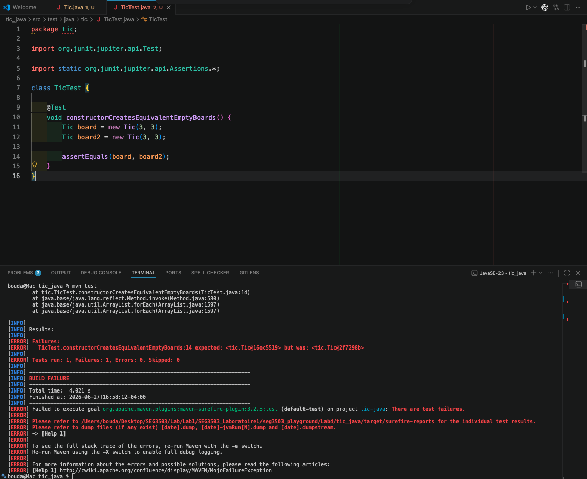

La capture ci-dessus montre le test ajouté pour cette première étape. Le test est volontairement simple, car l’objectif est d’introduire la première règle de comportement de la classe : deux tableaux vides de même taille doivent être égaux.

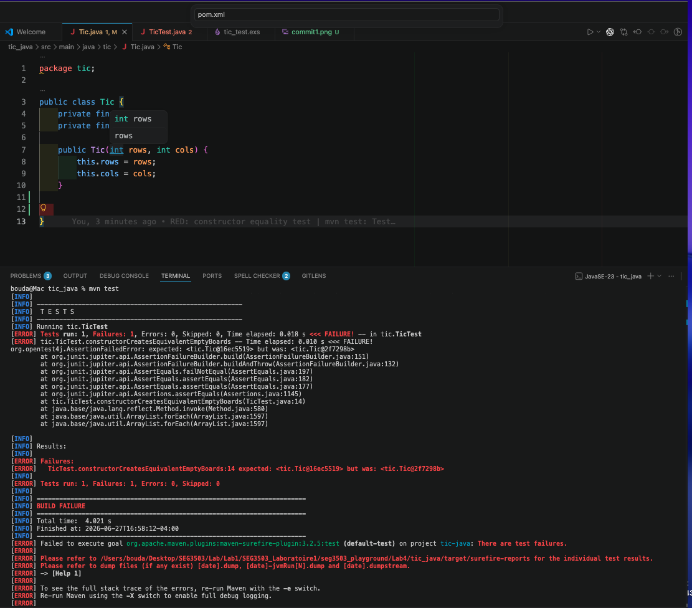

Dans cette capture, la classe `Tic` contient seulement les attributs nécessaires et le constructeur. L’implémentation est encore minimale, ce qui explique l’échec du test.

Le deuxième commit du groupe est le commit GREEN :

`af2d39d - GREEN: constructor equality passes | mvn test: Tests run: 1, Failures: 0, Errors: 0`

Pour faire passer le test, j’ai ajouté les méthodes `equals` et `hashCode`. La méthode `equals` compare maintenant les dimensions du tableau, c’est-à-dire le nombre de lignes et de colonnes. La méthode `hashCode` utilise les mêmes informations afin de respecter le contrat entre `equals` et `hashCode`.

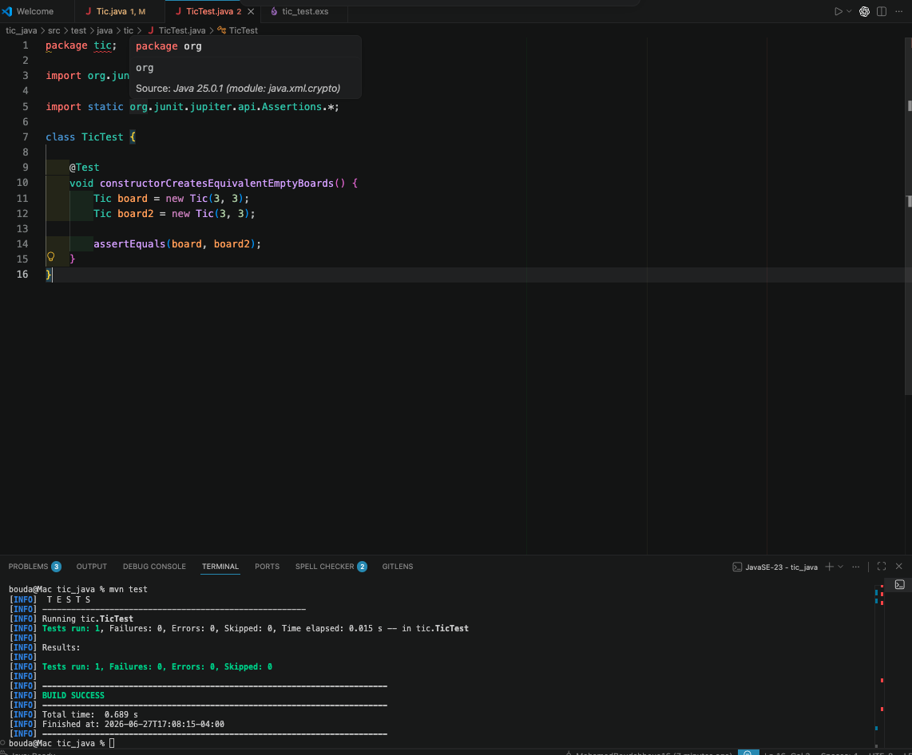

La capture montre que le test passe maintenant avec succès. Le résultat indique `Tests run: 1, Failures: 0, Errors: 0`, ce qui confirme que le comportement attendu est maintenant implémenté.

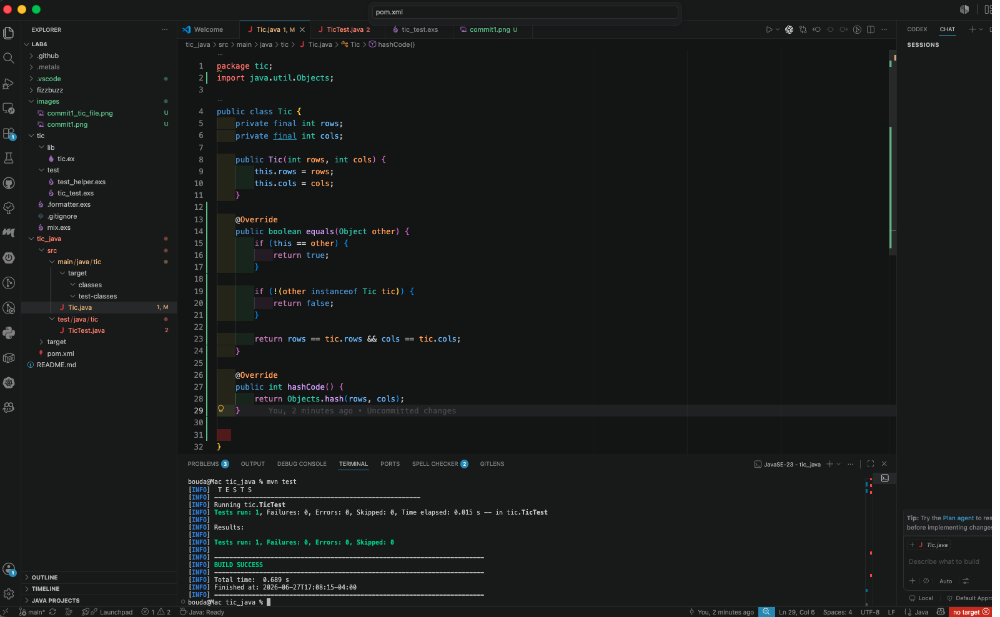

Après cette étape, la classe `Tic` possède une première logique correcte d’égalité. Ce groupe montre bien le principe de TDD : écrire un test qui échoue, puis ajouter seulement le code nécessaire pour le faire passer.


## Groupe 2 - Affichage textuel du tableau vide

Dans le deuxième groupe de commits, j’ai ajouté une fonctionnalité d’affichage du tableau. L’objectif était que la classe `Tic` puisse retourner une représentation textuelle lisible d’un tableau vide. Cette représentation est utile pour vérifier visuellement l’état du tableau et pour préparer les prochaines fonctionnalités.

Le commit RED de ce groupe est :

`0e88ea7 - RED: empty board string test | mvn test: Tests run: 2, Failures: 1, Errors: 0`

Dans ce commit, j’ai ajouté le test `emptyBoardHasReadableString`. Ce test crée un tableau `3 x 3` et vérifie que l’appel à `toString()` retourne exactement la chaîne suivante :

```text
_|_|_
_|_|_
_|_|_
```

Comme la méthode `toString()` n’était pas encore implémentée pour retourner ce format, le test échoue. C’est le comportement attendu dans une étape RED.

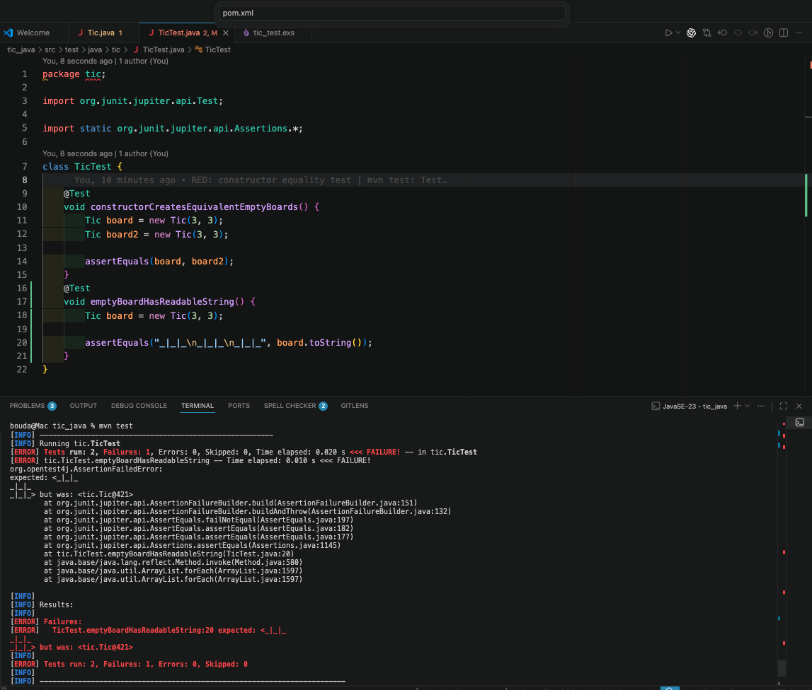

La capture montre le nouveau test ajouté dans `TicTest.java`. Le test vérifie non seulement que le tableau existe, mais aussi que son affichage respecte un format précis avec des séparateurs entre les colonnes.

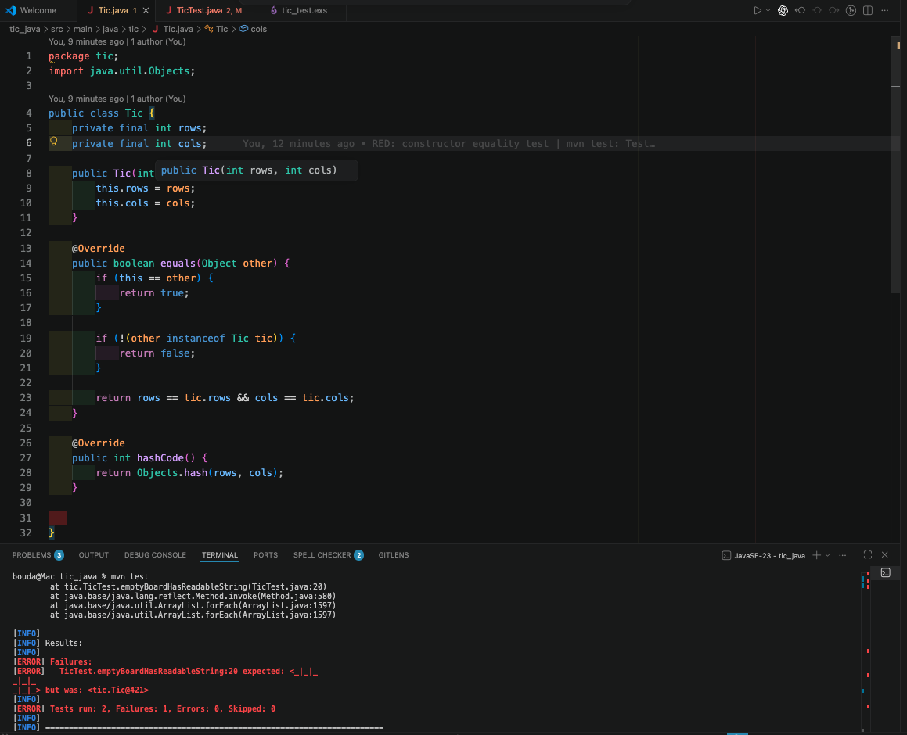

Dans cette capture, le code de production n’est pas encore capable de produire l’affichage attendu. C’est pour cela que le test ajouté échoue.

Le commit GREEN de ce groupe est :

`78e1caa - GREEN: empty board string passes | mvn test: Tests run: 2, Failures: 0, Errors: 0`

Pour faire passer le test, j’ai ajouté une méthode `toString()` qui construit progressivement la représentation du tableau avec un `StringBuilder`. La méthode parcourt chaque ligne et chaque colonne, ajoute le caractère `_` pour représenter une case vide, puis ajoute les séparateurs `|` entre les colonnes.

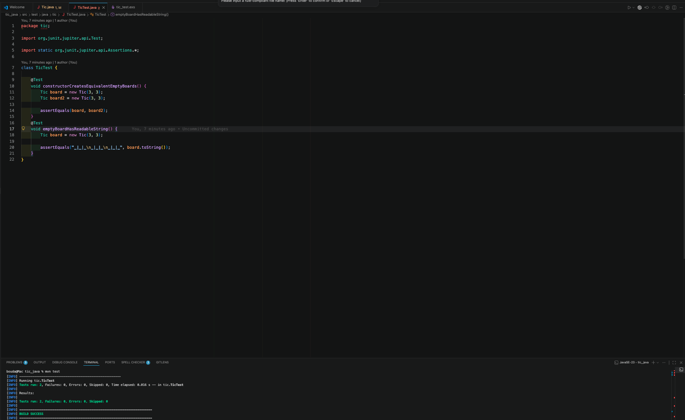

La capture montre que les deux tests passent maintenant. Le premier test sur l’égalité des tableaux continue de fonctionner, et le nouveau test sur l’affichage du tableau passe aussi.

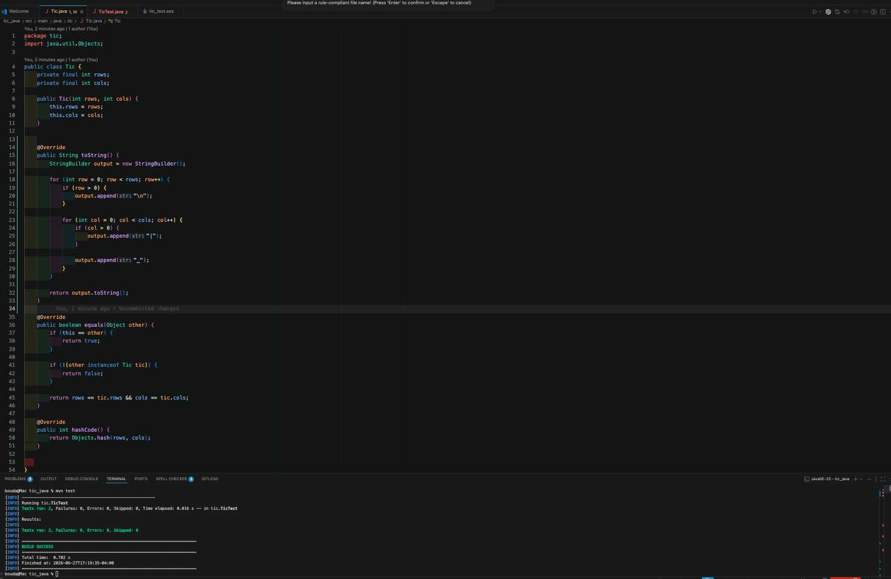

Cette capture montre l’ajout de la méthode `toString`. Le code reste simple et direct, ce qui respecte l’objectif de l’étape GREEN : faire passer le test sans encore complexifier inutilement la solution.


## Groupe 3 - Placement d’un coup dans une case

Dans le troisième groupe de commits, j’ai commencé à transformer la classe `Tic` en une classe qui peut réellement contenir l’état d’un tableau de jeu. Avant cette étape, le tableau était seulement représenté par ses dimensions et par une chaîne générée avec des cases vides. Il fallait maintenant ajouter une structure interne pour mémoriser les coups placés dans les cases.

Le commit RED de ce groupe est :

`5d4e15c - RED: placing move test | mvn test: compilation failure, missing place and cellAt`

Dans ce commit, j’ai ajouté un test qui vérifie qu’un coup peut être placé dans une case précise du tableau. Le test utilise deux nouvelles méthodes : `place(int row, int col)` et `cellAt(int row, int col)`. La méthode `place` doit placer un symbole dans une case, tandis que `cellAt` doit permettre de lire le contenu d’une case.

Le test échoue en compilation parce que ces deux méthodes n’existent pas encore dans la classe `Tic`. Même si les tests ne s’exécutent pas complètement, cette étape reste une étape RED, car elle montre clairement que la fonctionnalité demandée est absente.

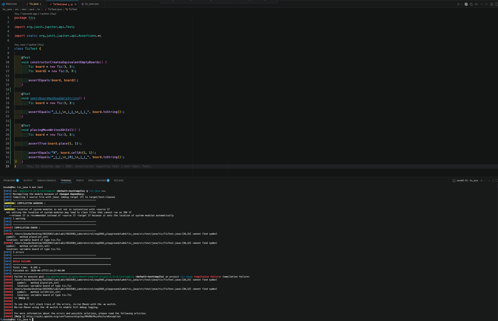

La capture montre le test `placingMoveWritesXAtCell`. Ce test vérifie trois choses : la méthode `place` doit retourner `true`, la case ciblée doit contenir `X`, et l’affichage du tableau doit montrer le `X` au bon endroit.

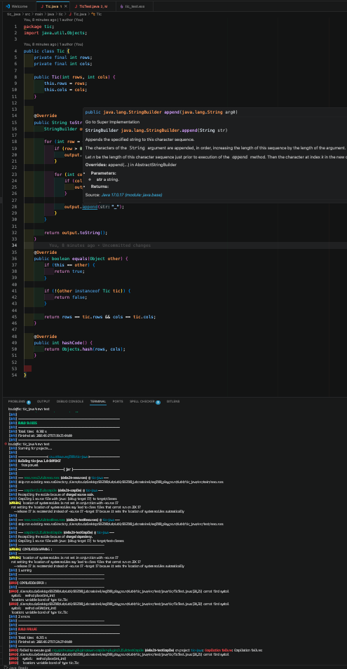

La capture montre que le code ne contient pas encore les méthodes nécessaires. Cela explique l’échec de compilation.

Le commit GREEN de ce groupe est :

`74a25e1 - GREEN: placing move passes | mvn test: Tests run: 3, Failures: 0, Errors: 0`

Pour faire passer le test, j’ai ajouté un tableau interne `String[][] board`. Chaque case est initialisée avec `_`. Ensuite, j’ai ajouté la méthode `cellAt` pour retourner le contenu d’une case, ainsi que la méthode `place` pour placer un `X` dans une case vide. J’ai aussi ajouté une méthode privée `validatePosition` afin d’éviter les positions invalides.

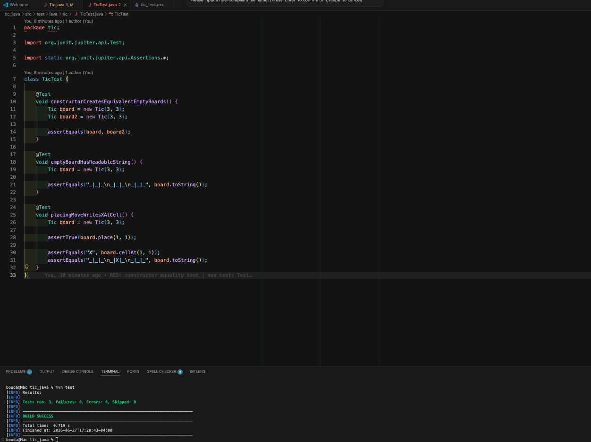

La capture montre que les trois tests passent. Cela confirme que la classe peut maintenant mémoriser l’état réel du tableau, et que l’affichage reflète correctement les coups placés.

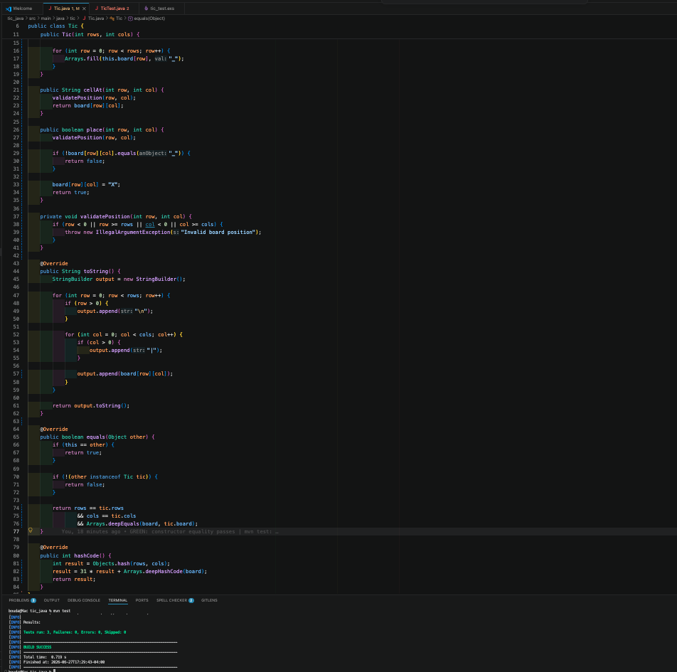

Cette étape est importante, car elle ajoute une vraie structure d’état à la classe `Tic`. Avant ce groupe, la classe produisait seulement une représentation vide. Après ce groupe, elle peut maintenant stocker et afficher les coups.


## Groupe 4 - Gestion du tour des joueurs

Dans le quatrième groupe de commits, j’ai ajouté la gestion du tour des joueurs. Jusqu’ici, la méthode `place` plaçait toujours le symbole `X`. Pour se rapprocher davantage du fonctionnement d’un jeu Tic-Tac-Toe, il fallait que le premier joueur soit `X`, puis que le tour alterne entre `X` et `O` après chaque coup valide.

Le commit RED de ce groupe est :

`ac444a0 - RED: player turn test | mvn test: compilation failure, missing getTurn`

Dans ce commit, j’ai ajouté un test pour vérifier que le tour commence avec `X`, passe à `O` après un premier coup, puis revient à `X` après un deuxième coup. Le test utilise une nouvelle méthode `getTurn`. Comme cette méthode n’existe pas encore, Maven retourne une erreur de compilation.

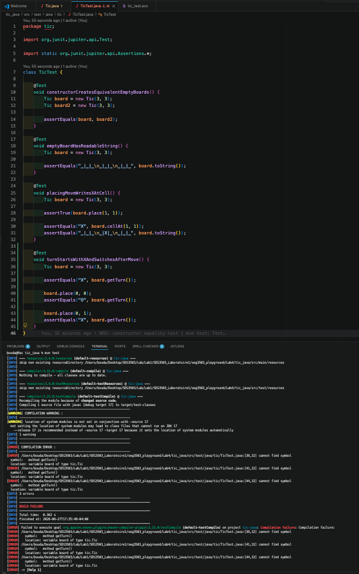

La capture montre le test `turnStartsWithXAndSwitchesAfterMove`. Ce test décrit clairement le comportement attendu : le joueur courant doit être visible avec `getTurn`, et ce joueur doit changer après chaque placement valide.

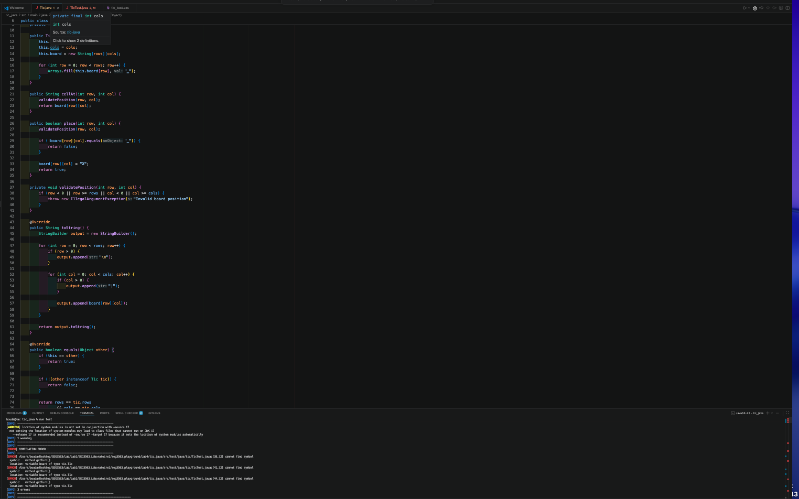

À cette étape, la classe ne contient pas encore le champ `turn` ni la méthode `getTurn`. L’échec est donc normal dans le cycle TDD.

Le commit GREEN de ce groupe est :

`520f123 - GREEN: player turn passes | mvn test: Tests run: 4, Failures: 0, Errors: 0`

Pour faire passer le test, j’ai ajouté un attribut `turn` initialisé à `X`. J’ai ensuite ajouté la méthode `getTurn()` pour retourner le joueur courant. La méthode `place()` a aussi été modifiée pour placer le symbole du joueur courant, puis appeler une méthode privée `switchTurn()` qui alterne entre `X` et `O`.

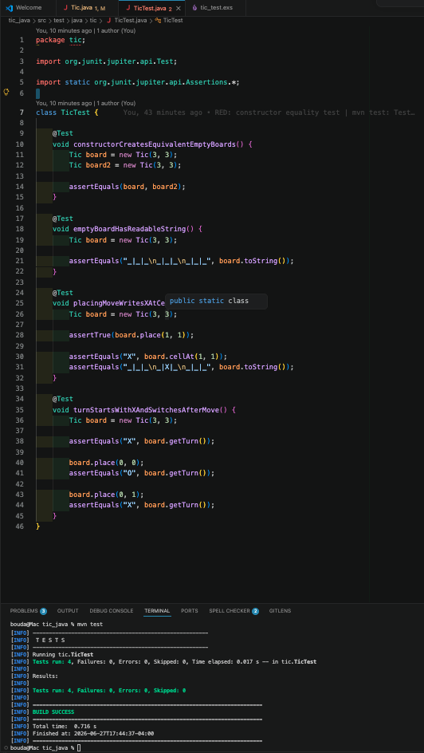

La capture montre que les quatre tests passent. Cela confirme que les anciennes fonctionnalités fonctionnent encore, et que la nouvelle logique d’alternance des tours est correcte.

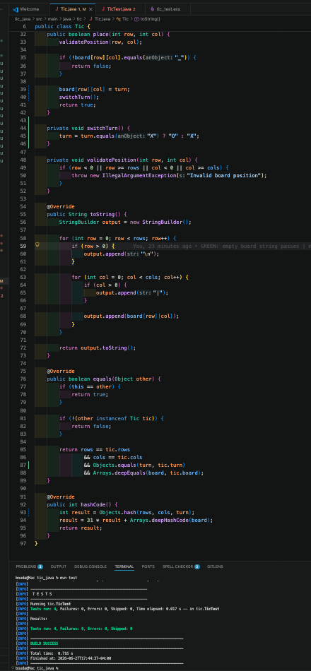

Cette fonctionnalité améliore beaucoup le modèle, car le tableau ne place plus seulement un `X` de façon fixe. Il commence à se comporter comme un vrai jeu avec deux joueurs.


## Groupe 5 - Détection d’un tableau vide ou plein

Dans le cinquième groupe de commits, j’ai ajouté deux méthodes pour analyser l’état global du tableau : `isEmpty()` et `isFull()`. Ces méthodes permettent de savoir si aucun coup n’a encore été joué ou si toutes les cases sont occupées.

Le commit RED de ce groupe est :

`a860292 - RED: empty and full board test | mvn test: compilation failure, missing isEmpty and isFull`

Dans ce commit, j’ai ajouté un test avec un petit tableau `1 x 2`. Le test vérifie d’abord que le tableau est vide et qu’il n’est pas plein. Ensuite, il place un premier coup et vérifie que le tableau n’est plus vide mais pas encore plein. Finalement, il place un deuxième coup et vérifie que le tableau est plein.

Comme les méthodes `isEmpty` et `isFull` n’existent pas encore, le test échoue en compilation. Cela représente encore une étape RED correcte.

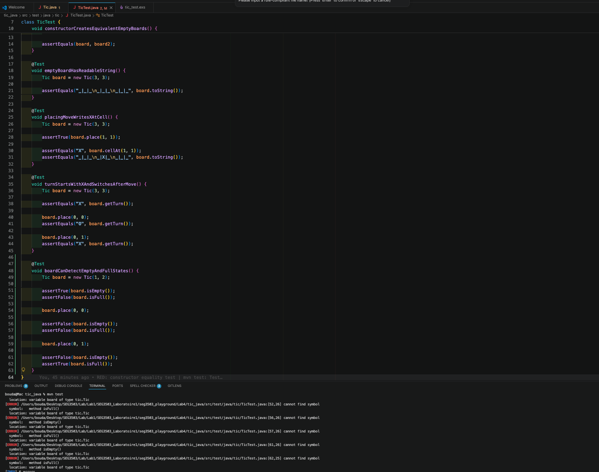

La capture montre que le test couvre plusieurs états du tableau : vide, partiellement rempli et complètement rempli. Cela rend le test plus utile, car il ne vérifie pas seulement un cas isolé.

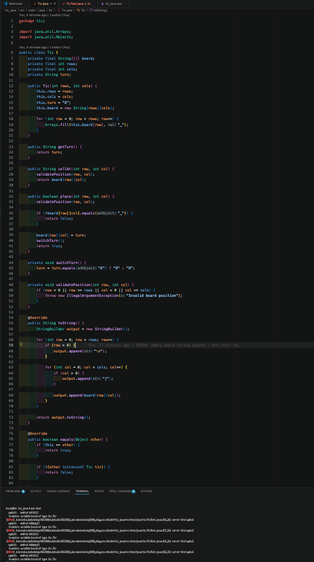

La capture montre que la classe n’a pas encore les méthodes nécessaires. L’échec de compilation confirme donc que le test introduit bien une nouvelle fonctionnalité.

Le commit GREEN de ce groupe est :

`6710e29 - GREEN: empty and full board passes | mvn test: Tests run: 5, Failures: 0, Errors: 0`

Pour faire passer le test, j’ai ajouté les méthodes `isEmpty()` et `isFull()`. Les deux méthodes parcourent toutes les cases du tableau. `isEmpty()` retourne `false` dès qu’une case n’est pas vide. `isFull()` retourne `false` dès qu’une case est encore vide. Cette logique est simple, mais elle couvre correctement les états importants du tableau.

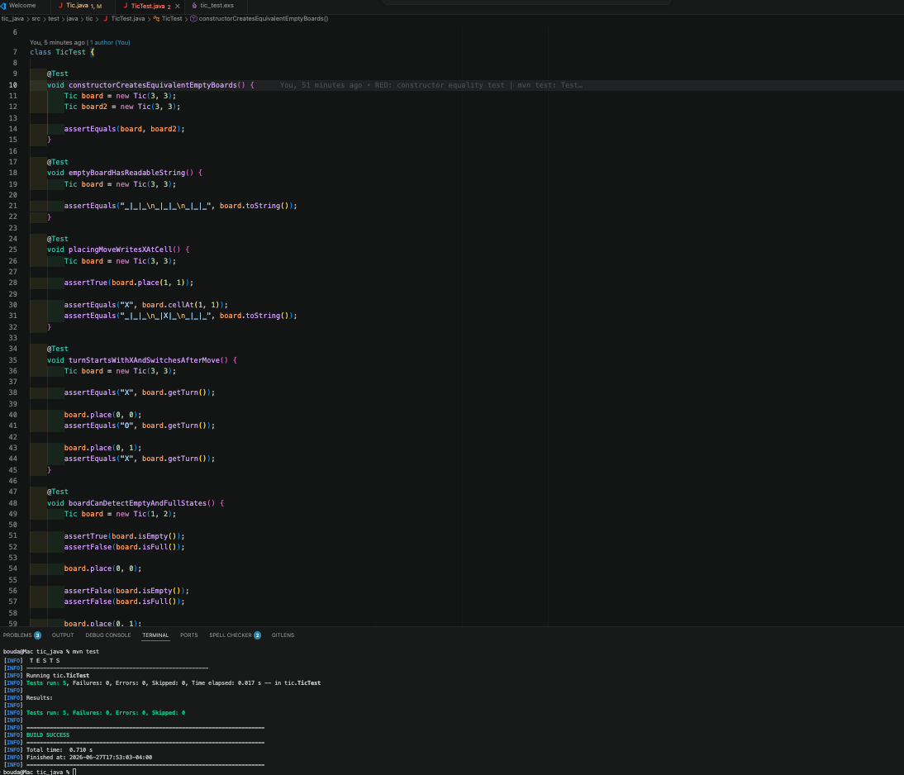

La capture montre que les cinq tests passent. Cela confirme que toutes les fonctionnalités développées dans les cinq groupes fonctionnent ensemble.

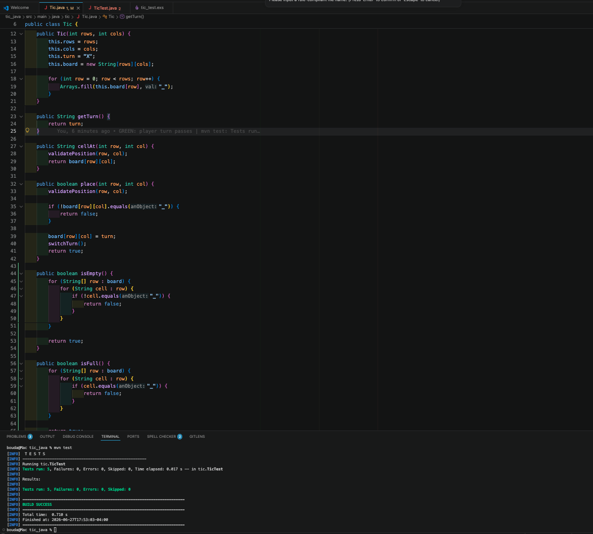

À la fin de ce groupe, la classe `Tic` possède déjà une base fonctionnelle assez complète : elle peut créer un tableau, afficher son contenu, placer des coups, gérer les tours, et détecter si le tableau est vide ou plein.


## Refactoring final

Après les cinq groupes RED/GREEN, j’ai effectué une étape de refactoring. Le but du refactoring n’était pas d’ajouter une nouvelle fonctionnalité, mais d’améliorer la qualité du code tout en gardant exactement le même comportement.

Le commit de refactoring est :

`f9f2b1c - REFACTOR: clean tic board constants and helpers | mvn test: Tests run: 5, Failures: 0, Errors: 0`

Avant le refactoring, certaines valeurs comme `_`, `X` et `O` étaient écrites directement dans plusieurs endroits du code. Cette répétition fonctionne, mais elle rend le code moins propre et plus difficile à modifier. J’ai donc ajouté des constantes comme `EMPTY_CELL`, `FIRST_PLAYER` et `SECOND_PLAYER`.

J’ai aussi ajouté une méthode privée `isCellEmpty` pour rendre la méthode `place` plus lisible. Au lieu de vérifier directement `board[row][col].equals("_")`, le code utilise maintenant une méthode dont le nom explique clairement l’intention.

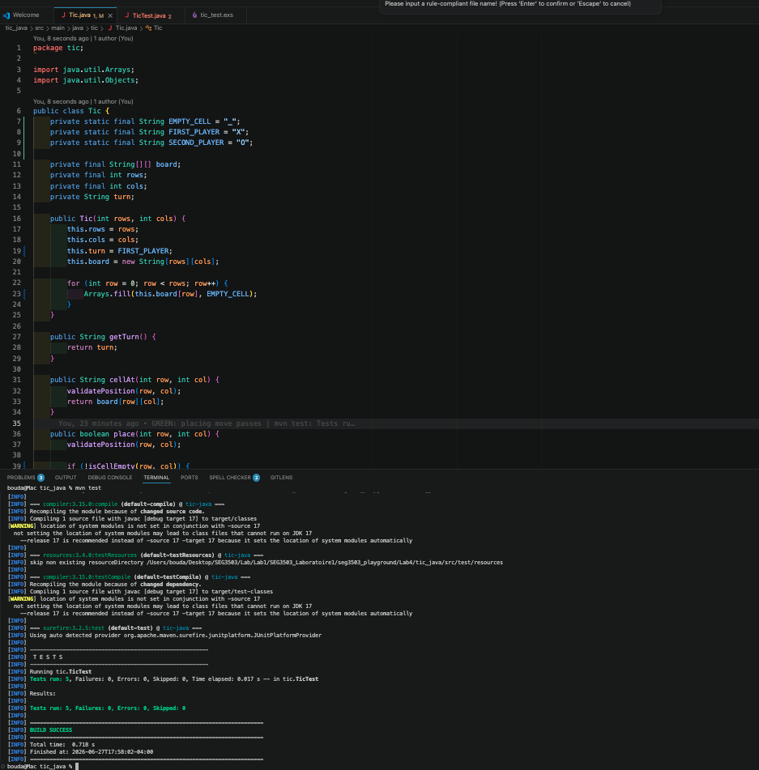

La capture montre le code après refactoring. La logique est la même, mais le code est plus clair. Les constantes rendent les symboles du jeu plus faciles à comprendre, et les méthodes auxiliaires améliorent la lisibilité.

Après le refactoring, tous les tests passent encore avec succès. Cela confirme que le comportement du programme n’a pas été modifié. Le refactoring a donc atteint son objectif : améliorer la structure du code sans casser les fonctionnalités existantes.


## Analyse globale du cycle TDD

Ce laboratoire montre clairement l’intérêt du cycle TDD. À chaque étape, j’ai commencé par exprimer le comportement attendu sous forme de test. Lorsque le test échouait, cela confirmait que la fonctionnalité n’était pas encore présente. Ensuite, j’ai ajouté uniquement le code nécessaire pour faire passer le test. Cette approche permet de construire le programme progressivement, sans ajouter trop de logique d’un seul coup.

Les commits RED montrent les fonctionnalités manquantes. Certains commits RED échouent avec des assertions, tandis que d’autres échouent en compilation parce que les méthodes testées n’existaient pas encore. Dans les deux cas, l’échec est utile, car il indique clairement ce qui doit être implémenté.

Les commits GREEN montrent l’ajout progressif du code de production. Chaque commit GREEN augmente le nombre de tests qui passent. On passe donc de 1 test réussi au début à 5 tests réussis à la fin. Cela donne un historique Git clair et facile à suivre.

Le commit REFACTOR montre la dernière étape du cycle. Le code a été nettoyé avec des constantes et une méthode auxiliaire, mais les cinq tests continuent de passer. Cela prouve que le refactoring n’a pas changé le comportement attendu.


## Utilisation de Git

Tout au long du laboratoire, j’ai utilisé Git pour garder un historique clair de mon travail. Chaque étape importante du cycle TDD a été associée à un commit. Les messages de commit indiquent si l’étape correspond à RED, GREEN ou REFACTOR, et ils incluent aussi le résultat de `mvn test`.

Cette organisation rend le travail plus facile à vérifier, car on peut suivre la progression du projet étape par étape. On peut voir quand un test a été ajouté, quand le code a été modifié pour le faire passer, et quand le code a été nettoyé.

Les commits principaux sont les suivants :

```text
6d78aed RED: constructor equality test
af2d39d GREEN: constructor equality passes
0e88ea7 RED: empty board string test
78e1caa GREEN: empty board string passes
5d4e15c RED: placing move test
74a25e1 GREEN: placing move passes
ac444a0 RED: player turn test
520f123 GREEN: player turn passes
a860292 RED: empty and full board test
6710e29 GREEN: empty and full board passes
f9f2b1c REFACTOR: clean tic board constants and helpers
```


## Commandes utilisées

Pour exécuter les tests, je me suis placé dans le dossier du projet Java :

```bash
cd Lab4/tic_java
mvn test
```

Pour revenir à la racine du dépôt :

```bash
cd ../..
```

Pour vérifier l’état du dépôt :

```bash
git status
```

Pour ajouter un fichier précis sans ajouter les fichiers parasites :

```bash
git add Lab4/tic_java/src/main/java/tic/Tic.java
git add Lab4/tic_java/src/test/java/tic/TicTest.java
```

Pour consulter l’historique des commits du laboratoire :

```bash
git log --oneline -- Lab4/tic_java Lab4/README.md
```

## Conclusion

Ce laboratoire m’a permis de pratiquer le développement piloté par les tests de manière concrète. J’ai construit la classe `Tic` progressivement, en commençant toujours par un test avant d’écrire l’implémentation. Cette méthode m’a forcé à réfléchir au comportement attendu avant de modifier le code.

Les cinq groupes de commits montrent une progression claire : création du tableau, affichage, placement d’un coup, gestion du tour et détection d’un tableau vide ou plein. Le refactoring final a ensuite permis d’améliorer la lisibilité du code sans casser les tests.

À la fin du laboratoire, tous les tests JUnit passent avec succès :

```text
Tests run: 5, Failures: 0, Errors: 0, Skipped: 0
BUILD SUCCESS
```

Le projet final respecte donc le cycle TDD demandé : RED, GREEN et REFACTOR.
