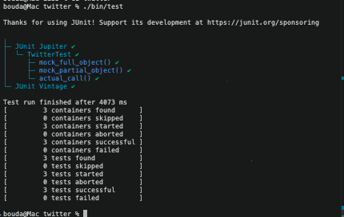
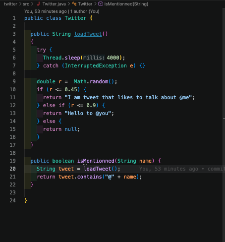
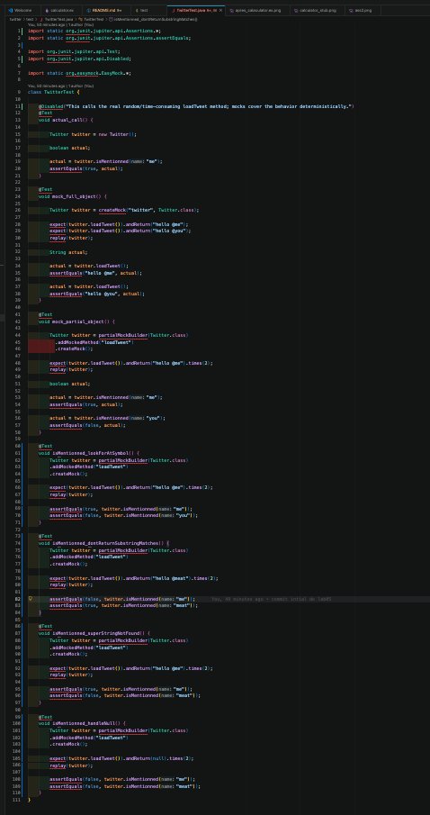
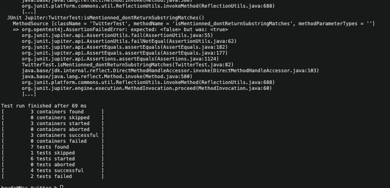
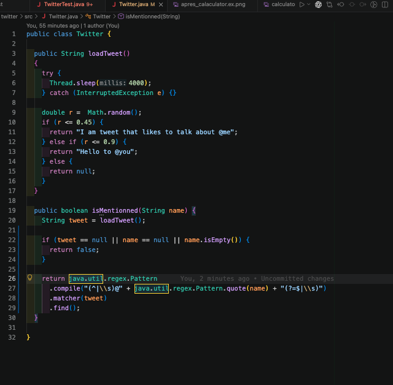
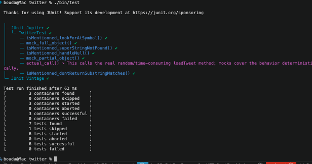

# SEG3503 Lab 05 : Mocks and Stubs

Groupe : travail individuel

Mohamed Boudabbous

Numéro étudiant : 300376202

Groupe 9
lien github: https://github.com/MohamedBoudabbous/seg3503_playground/tree/main/Lab5

## Grades

### Objectif

L’objectif de cette partie du laboratoire était de comprendre le rôle d’un stub dans une application. Le projet `Grades` possédait déjà une interface web, mais le module responsable du calcul des notes n’était pas encore disponible. Le bouton `Calculate` appelait donc un module manquant, ce qui empêchait l’application de fonctionner correctement.

Dans cette partie, j’ai d’abord ajouté un stub pour permettre à l’application de fonctionner temporairement. Ensuite, j’ai remplacé ce stub par une vraie implémentation inspirée du code de l’Assignment 2.

### Erreur initiale

Avant l’ajout du module `Grades.Calculator`, l’application démarrait, mais elle produisait une erreur lorsque l’on cliquait sur le bouton `Calculate`.

L’erreur indiquait que la fonction `Grades.Calculator.letter_grade/1` était introuvable. Cela signifie que la page LiveView essayait bien d’appeler le module `Grades.Calculator`, mais que ce module n’existait pas encore dans le projet.


Cette erreur montre que le problème ne venait pas de l’interface web, mais de l’absence du module back end chargé de calculer les notes.

### Résultat avec le stub

Après l’ajout du stub `Grades.Calculator`, l’application web ne plante plus lorsque l’on clique sur le bouton `Calculate`.

La page affiche maintenant une note en pourcentage, une note sous forme de lettre et une note numérique.


Dans cet exemple, l’application affiche une lettre `B+`, une note numérique `3` et un pourcentage `47`.

Ces valeurs sont générées aléatoirement. Elles ne sont pas basées sur les données saisies dans le formulaire. Cela confirme que la page LiveView est correctement connectée au module de calcul, mais que ce module ne contient pas encore la vraie logique de calcul.

### Code du stub

Pour résoudre temporairement le problème, j’ai créé le fichier suivant :

```text
lib/grades/calculator.ex
````

Le module contient les trois fonctions attendues par l’application : `percentage_grade/1`, `letter_grade/1` et `numeric_grade/1`.


Ce code ne calcule pas réellement la note finale. Il retourne simplement des valeurs aléatoires pour vérifier que l’interface web peut communiquer avec le module `Grades.Calculator`.

### Observations sur le stub

Après l’ajout du stub `Grades.Calculator`, l’application web ne plante plus lorsque l’on clique sur le bouton Calculate. La page affiche une note en pourcentage, une note sous forme de lettre et une note numérique. Cependant, ces valeurs sont générées aléatoirement et ne sont pas basées sur les données saisies dans le formulaire. Cela confirme que la page LiveView est correctement connectée au module de calcul, mais que ce module ne contient pas encore la vraie logique de calcul.

Le stub est donc utile pour tester l’intégration entre les modules. Il permet de vérifier que le front end et le back end communiquent correctement, même si la logique finale n’est pas encore implémentée.

### Remplacement par le code de l’Assignment 2

Après avoir validé que le stub fonctionnait, j’ai remplacé le contenu du module `Grades.Calculator` par une vraie implémentation du calculateur de notes.


Le nouveau code calcule la moyenne des devoirs, la moyenne des labs, la note du midterm, la note du final et la note finale pondérée.
La pondération utilisée est la suivante :

Homework : 10%
Labs : 10%
Midterm : 30%
Final : 50%


Une difficulté importante était que les valeurs reçues depuis le formulaire web sont des chaînes de caractères. Par exemple, la valeur `100` saisie dans le navigateur est reçue par Elixir sous la forme `"100"`. Il faut donc convertir les valeurs en nombres avant d’effectuer les opérations mathématiques.

### Résultat final avec le vrai calculateur

J’ai ensuite testé l’application avec les valeurs données dans les slides du laboratoire.


Homework #1 : 89

Homework #2 : 92

Homework #3 : 100

Homework #4 : 48


Labs #1 : 100

Labs #2 : 100

Labs #3 : 25


Labs #5 : 100

Labs #6 : 25


Midterm : 73

Final : 83


Le résultat obtenu est le suivant :


Letter Grade : B+
Numeric Grade : 7
Percent : 79


### Analyse du résultat final

Contrairement au stub, le résultat final n’est plus aléatoire. Il est maintenant basé sur les données entrées dans le formulaire.

Le calcul donne les valeurs suivantes :


Homework average = 82.25

Labs average = 75

Midterm = 73

Final = 83


Avec la pondération utilisée, le calcul est :


82.25 * 0.10 + 75 * 0.10 + 73 * 0.30 + 83 * 0.50 = 79.125


Après arrondi, le pourcentage affiché est donc `79`.

Ce pourcentage correspond à la lettre `B+` et à la note numérique `7`.

### Conclusion

Le stub a permis de faire fonctionner l’application temporairement en remplaçant le module manquant par des fonctions simples qui retournent des valeurs aléatoires.

Cette étape a confirmé que l’interface web était correctement connectée au module `Grades.Calculator`.

Ensuite, le stub a été remplacé par une vraie implémentation capable de calculer les notes à partir des données saisies par l’utilisateur. La version finale de l’application calcule maintenant correctement le pourcentage final, la lettre correspondante et la note numérique.


## Twitter

### Objectif

L’objectif de cette partie du laboratoire était d’utiliser des mocks pour tester une méthode qui dépend d’un comportement non déterministe.

Dans le projet `twitter`, la méthode `loadTweet()` ne retourne pas toujours la même valeur. Elle utilise `Math.random()` et peut retourner un tweet contenant `@me`, un tweet contenant `@you`, ou `null`. Elle contient aussi un délai avec `Thread.sleep(4000)`, ce qui rend les tests lents et imprévisibles.

Pour cette raison, il est préférable de ne pas tester `isMentionned()` directement avec le vrai appel à `loadTweet()`. À la place, j’ai utilisé des partial mocks pour contrôler la valeur retournée par `loadTweet()`.

### Résultat initial des tests

Avant d’ajouter les nouveaux tests, le projet contenait déjà quelques tests de base. Le test `actual_call()` a été désactivé, car il appelle directement la vraie méthode `loadTweet()`, qui est lente et non déterministe.



Le résultat initial montre que les tests existants passent, mais ils ne couvrent pas encore tous les cas demandés dans le laboratoire.

### Code initial de Twitter

Au départ, la méthode `isMentionned()` était implémentée de manière très simple :

```java

public boolean isMentionned(String name) {
  String tweet = loadTweet();
  return tweet.contains("@" + name);
}

```



Cette version pose deux problèmes importants.

Premièrement, si `loadTweet()` retourne `null`, l’appel à `tweet.contains(...)` provoque une erreur, car on essaie d’appeler une méthode sur une valeur nulle.

Deuxièmement, cette version accepte les correspondances partielles. Par exemple, si le tweet contient `@meat`, alors `isMentionned("me")` retourne `true`, parce que `@meat` contient `@me`. Ce comportement est incorrect, car `me` et `meat` doivent être considérés comme deux mentions différentes.

### Tests ajoutés avec des mocks

J’ai ensuite ajouté les quatre tests demandés dans le laboratoire :

```text
isMentionned_lookForAtSymbol()
isMentionned_dontReturnSubstringMatches()
isMentionned_superStringNotFound()
isMentionned_handleNull()
```

Ces tests utilisent un partial mock de `Twitter`. La méthode `loadTweet()` est mockée, mais la vraie méthode `isMentionned()` est conservée. Cela permet de tester la logique de `isMentionned()` avec des valeurs contrôlées.



Les tests couvrent les cas suivants.

Le premier test vérifie qu’un nom est reconnu seulement lorsqu’il est précédé par `@`. Par exemple, avec le tweet `hello @me`, la recherche de `me` doit retourner `true`, mais la recherche de `you` doit retourner `false`.

Le deuxième test vérifie que les sous-chaînes ne sont pas acceptées. Avec le tweet `hello @meat`, la recherche de `me` doit retourner `false`, alors que la recherche de `meat` doit retourner `true`.

Le troisième test vérifie qu’une recherche plus longue que la mention réelle ne retourne pas un faux positif. Avec le tweet `hello @me`, la recherche de `me` doit retourner `true`, mais la recherche de `meat` doit retourner `false`.

Le quatrième test vérifie que la méthode gère correctement le cas où aucun tweet n’est disponible, c’est-à-dire lorsque `loadTweet()` retourne `null`.

### Résultat après l’ajout des tests

Après avoir ajouté les nouveaux tests, deux tests échouent.



Les deux tests qui échouent sont liés aux deux faiblesses de l’implémentation initiale.

Le test `isMentionned_dontReturnSubstringMatches()` échoue parce que l’ancien code utilise simplement `contains("@" + name)`. Cette logique considère donc que `@me` est présent dans `@meat`, ce qui est incorrect.

Le test `isMentionned_handleNull()` échoue parce que l’ancien code ne vérifie pas si `tweet` est `null` avant d’appeler `contains()`.

Ces échecs sont utiles, car ils montrent que les tests ajoutés détectent de vrais problèmes dans le code.

### Correction de Twitter

Pour corriger la méthode, j’ai modifié `isMentionned()` afin de gérer les valeurs nulles et d’éviter les correspondances partielles.

Le code corrigé est le suivant :

```java
public boolean isMentionned(String name) {
  String tweet = loadTweet();

  if (tweet == null || name == null || name.isEmpty()) {
    return false;
  }

  return java.util.regex.Pattern
    .compile("(^|\\s)@" + java.util.regex.Pattern.quote(name) + "(?=$|\\s)")
    .matcher(tweet)
    .find();
}
```



Cette version commence par vérifier si `tweet` est `null`, si `name` est `null`, ou si `name` est vide. Dans ces cas, la méthode retourne directement `false`.

Ensuite, elle utilise une expression régulière pour vérifier que la mention correspond exactement au nom recherché. Cela évite qu’une recherche de `me` soit acceptée dans une mention comme `@meat`.

### Résultat après correction

Après la correction, les tests passent correctement.



Le résultat final montre que les tests réussissent maintenant :

```text
7 tests found
1 test skipped
6 tests successful
0 tests failed
```

Le seul test ignoré est `actual_call()`, car il utilise la vraie méthode `loadTweet()`. Ce test est volontairement désactivé puisque son résultat dépend de `Math.random()` et qu’il ralentit les tests avec `Thread.sleep(4000)`.

### Analyse finale

Les mocks ont permis de tester `isMentionned()` de manière fiable. Sans mock, les tests dépendraient de la valeur aléatoire retournée par `loadTweet()`, ce qui pourrait produire des résultats différents à chaque exécution.

Les tests ajoutés ont révélé deux problèmes dans l’implémentation initiale. Le premier problème était l’absence de gestion du cas `null`. Le deuxième problème était l’utilisation de `contains()`, qui acceptait des correspondances partielles.

Après la correction, la méthode `isMentionned()` retourne les résultats attendus pour les cas testés. Elle reconnaît les mentions exactes, refuse les sous-chaînes, et gère correctement le cas où aucun tweet n’est disponible.

### Conclusion

Cette partie du laboratoire montre l’utilité des mocks pour tester du code qui dépend de méthodes lentes, aléatoires ou difficiles à contrôler.

Le partial mock a permis de remplacer seulement `loadTweet()` tout en conservant la vraie logique de `isMentionned()`. Grâce à cette approche, les tests sont devenus rapides, déterministes et capables de détecter les erreurs réelles dans le code.


