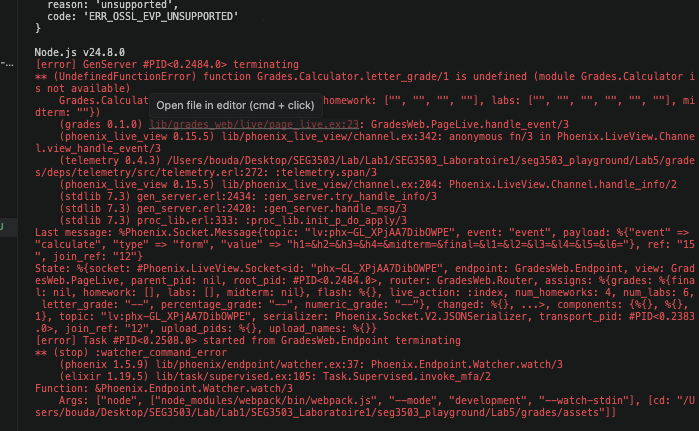
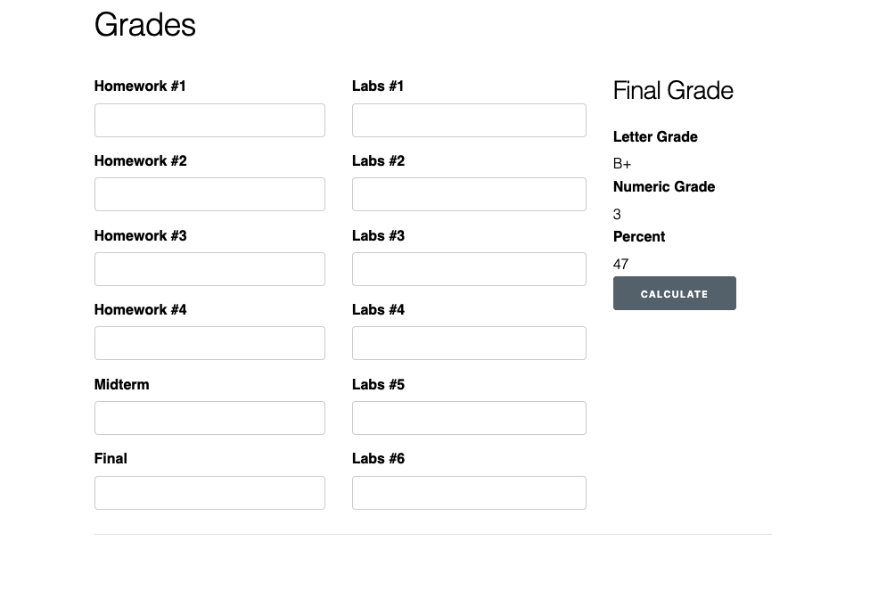
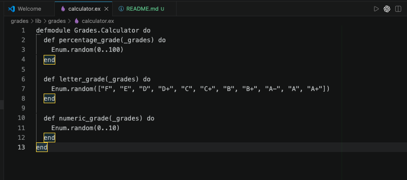
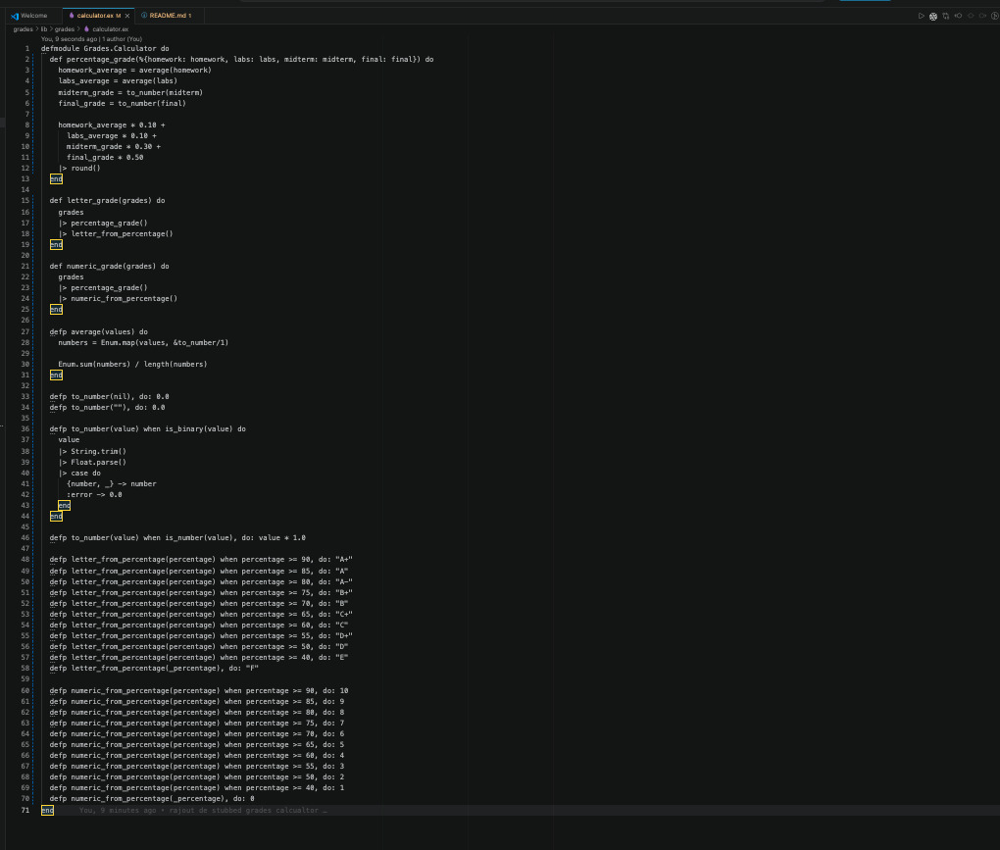
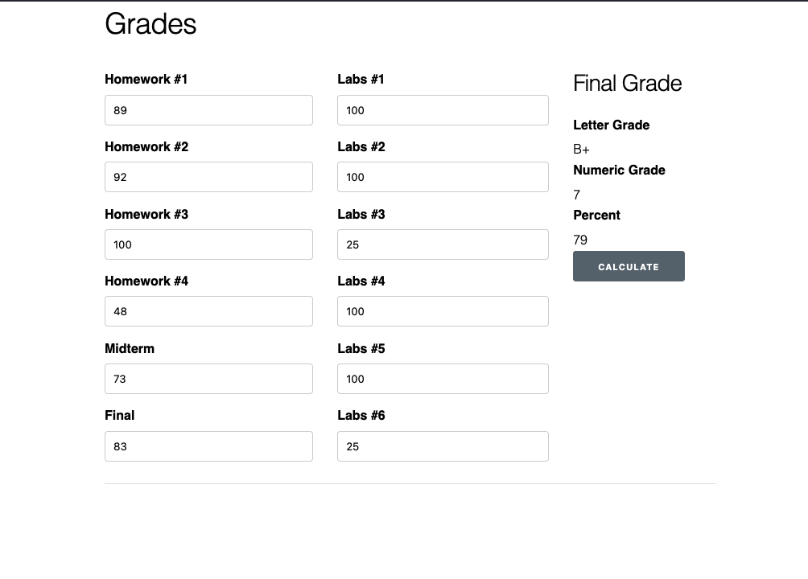

# Lab 05 : Mocks and Stubs

## Grades

### Objectif

L’objectif de cette partie du laboratoire était de comprendre le rôle d’un stub dans une application. Le projet `Grades` possédait déjà une interface web, mais le module responsable du calcul des notes n’était pas encore disponible. Le bouton `Calculate` appelait donc un module manquant, ce qui empêchait l’application de fonctionner correctement.

Dans cette partie, j’ai d’abord ajouté un stub pour permettre à l’application de fonctionner temporairement. Ensuite, j’ai remplacé ce stub par une vraie implémentation inspirée du code de l’Assignment 2.

### Erreur initiale

Avant l’ajout du module `Grades.Calculator`, l’application démarrait, mais elle produisait une erreur lorsque l’on cliquait sur le bouton `Calculate`.

L’erreur indiquait que la fonction `Grades.Calculator.letter_grade/1` était introuvable. Cela signifie que la page LiveView essayait bien d’appeler le module `Grades.Calculator`, mais que ce module n’existait pas encore dans le projet.



Cette erreur montre que le problème ne venait pas de l’interface web, mais de l’absence du module back end chargé de calculer les notes.

### Résultat avec le stub

Après l’ajout du stub `Grades.Calculator`, l’application web ne plante plus lorsque l’on clique sur le bouton `Calculate`.

La page affiche maintenant une note en pourcentage, une note sous forme de lettre et une note numérique.



Dans cet exemple, l’application affiche une lettre `B+`, une note numérique `3` et un pourcentage `47`.

Ces valeurs sont générées aléatoirement. Elles ne sont pas basées sur les données saisies dans le formulaire. Cela confirme que la page LiveView est correctement connectée au module de calcul, mais que ce module ne contient pas encore la vraie logique de calcul.

### Code du stub

Pour résoudre temporairement le problème, j’ai créé le fichier suivant :

```text
lib/grades/calculator.ex
````

Le module contient les trois fonctions attendues par l’application : `percentage_grade/1`, `letter_grade/1` et `numeric_grade/1`.



Ce code ne calcule pas réellement la note finale. Il retourne simplement des valeurs aléatoires pour vérifier que l’interface web peut communiquer avec le module `Grades.Calculator`.

### Observations sur le stub

Après l’ajout du stub `Grades.Calculator`, l’application web ne plante plus lorsque l’on clique sur le bouton Calculate. La page affiche une note en pourcentage, une note sous forme de lettre et une note numérique. Cependant, ces valeurs sont générées aléatoirement et ne sont pas basées sur les données saisies dans le formulaire. Cela confirme que la page LiveView est correctement connectée au module de calcul, mais que ce module ne contient pas encore la vraie logique de calcul.

Le stub est donc utile pour tester l’intégration entre les modules. Il permet de vérifier que le front end et le back end communiquent correctement, même si la logique finale n’est pas encore implémentée.

### Remplacement par le code de l’Assignment 2

Après avoir validé que le stub fonctionnait, j’ai remplacé le contenu du module `Grades.Calculator` par une vraie implémentation du calculateur de notes.



Le nouveau code calcule la moyenne des devoirs, la moyenne des labs, la note du midterm, la note du final et la note finale pondérée.
La pondération utilisée est la suivante :

Homework : 10%
Labs : 10%
Midterm : 30%
Final : 50%


Une difficulté importante était que les valeurs reçues depuis le formulaire web sont des chaînes de caractères. Par exemple, la valeur `100` saisie dans le navigateur est reçue par Elixir sous la forme `"100"`. Il faut donc convertir les valeurs en nombres avant d’effectuer les opérations mathématiques.

### Résultat final avec le vrai calculateur

J’ai ensuite testé l’application avec les valeurs données dans les slides du laboratoire.


Homework #1 : 89

Homework #2 : 92

Homework #3 : 100

Homework #4 : 48


Labs #1 : 100

Labs #2 : 100

Labs #3 : 25


Labs #5 : 100

Labs #6 : 25


Midterm : 73

Final : 83


Le résultat obtenu est le suivant :


Letter Grade : B+
Numeric Grade : 7
Percent : 79




### Analyse du résultat final

Contrairement au stub, le résultat final n’est plus aléatoire. Il est maintenant basé sur les données entrées dans le formulaire.

Le calcul donne les valeurs suivantes :


Homework average = 82.25

Labs average = 75

Midterm = 73

Final = 83


Avec la pondération utilisée, le calcul est :


82.25 * 0.10 + 75 * 0.10 + 73 * 0.30 + 83 * 0.50 = 79.125


Après arrondi, le pourcentage affiché est donc `79`.

Ce pourcentage correspond à la lettre `B+` et à la note numérique `7`.

### Conclusion

Le stub a permis de faire fonctionner l’application temporairement en remplaçant le module manquant par des fonctions simples qui retournent des valeurs aléatoires.

Cette étape a confirmé que l’interface web était correctement connectée au module `Grades.Calculator`.

Ensuite, le stub a été remplacé par une vraie implémentation capable de calculer les notes à partir des données saisies par l’utilisateur. La version finale de l’application calcule maintenant correctement le pourcentage final, la lettre correspondante et la note numérique.


## twiter
on implmente les tes