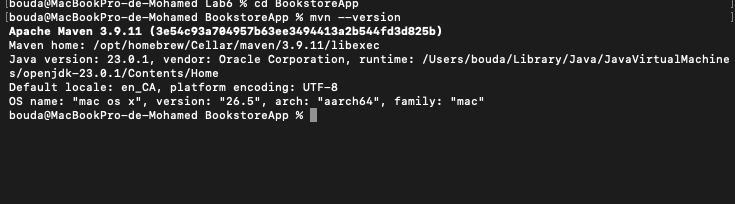
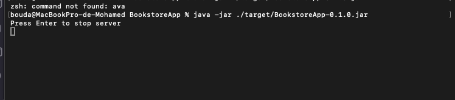
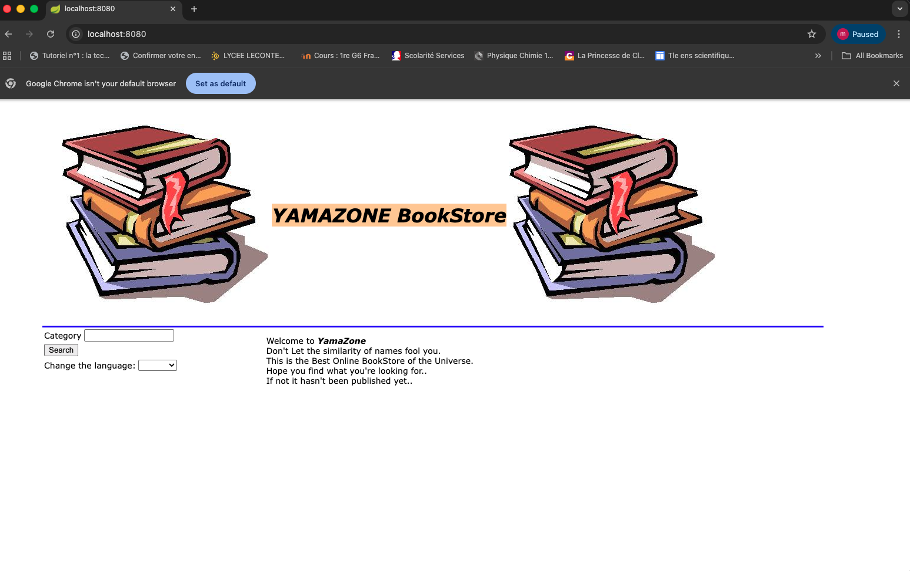
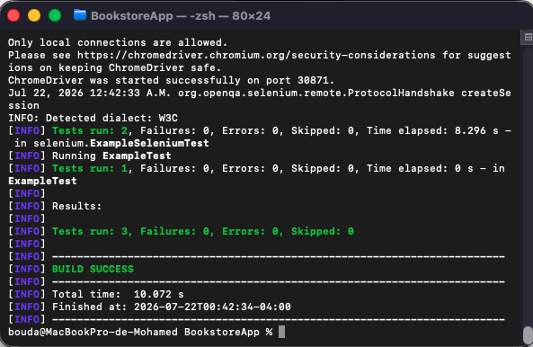
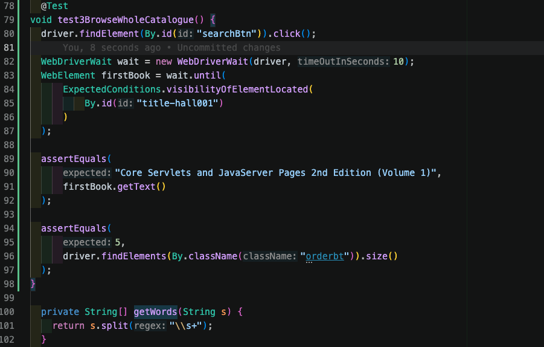
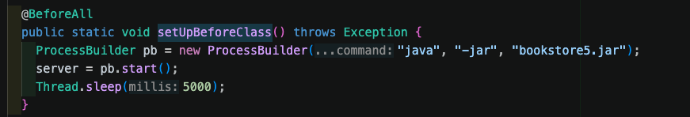
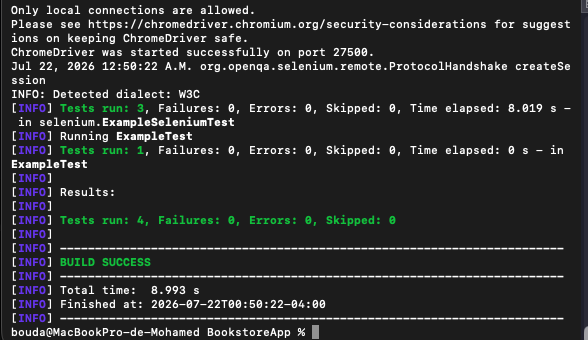

# SEG3503 Lab 06/07 : Selenium WebDriver

Groupe : 9

Mohamed Boudabbous

Numéro étudiant : 300376202

Groupe 9

lien github: https://github.com/MohamedBoudabbous/seg3503_playground/tree/main/Lab6

## BookstoreApp

### Objectif

L’objectif de ce laboratoire était d’utiliser Selenium WebDriver pour automatiser des tests d’acceptation sur une application web.

Le projet fourni contient l’application `YAMAZONE BookStore` ainsi que deux tests Selenium initiaux. Ces tests ouvrent automatiquement Google Chrome et vérifient certains éléments de l’interface.

Dans ce laboratoire, j’ai d’abord compilé et exécuté l’application avec Maven. Ensuite, j’ai fait fonctionner les tests Selenium fournis avec la version actuelle de Google Chrome. Finalement, j’ai ajouté un test supplémentaire pour vérifier la consultation du catalogue lorsque la catégorie recherchée est vide.

### Compilation et exécution de l’application

J’ai d’abord vérifié les versions de Maven et de Java installées sur mon ordinateur avec la commande suivante :

```bash
mvn --version
```

La sortie confirme que Maven est correctement installé et qu’il utilise une version compatible de Java.



Le projet a ensuite été compilé avec la commande suivante :

```bash
mvn compile
```

La compilation se termine correctement avec le résultat `BUILD SUCCESS`.


J’ai ensuite préparé le fichier exécutable de l’application sans lancer les tests avec la commande suivante :

```bash
mvn package -DskipTests
```

Cette commande compile le projet et crée le fichier `BookstoreApp-0.1.0.jar` dans le répertoire `target`.


L’application a ensuite été lancée avec la commande suivante :

```bash
java -jar ./target/BookstoreApp-0.1.0.jar
```

Le message `Press Enter to stop server` confirme que le serveur de l’application a été lancé.



Après le démarrage du serveur, l’application est accessible dans Google Chrome à l’adresse suivante :

```text
http://localhost:8080
```

La page principale affiche le titre `YAMAZONE BookStore`, un champ permettant de rechercher les livres par catégorie et un menu permettant de changer la langue.



### Configuration de ChromeDriver

Le projet utilisait initialement la version `4.0.0` de WebDriverManager. Cette ancienne version sélectionnait ChromeDriver 114, qui n’était plus compatible avec la version actuelle de Google Chrome installée sur mon ordinateur.

Les tests produisaient donc l’erreur suivante :

```text
session not created: This version of ChromeDriver only supports Chrome version 114
```

Pour corriger ce problème, j’ai remplacé la version de WebDriverManager dans le fichier `pom.xml` par la version `6.3.4`.

```xml
<dependency>
  <groupId>io.github.bonigarcia</groupId>
  <artifactId>webdrivermanager</artifactId>
  <version>6.3.4</version>
</dependency>
```

Le code Selenium continue ensuite d’utiliser Google Chrome avec la configuration suivante :

```java
WebDriverManager.chromedriver().setup();
driver = new ChromeDriver();
```

Après cette modification, WebDriverManager télécharge automatiquement une version compatible de ChromeDriver et les tests peuvent ouvrir Google Chrome correctement.

### Tests Selenium initiaux

Le projet contenait initialement deux tests Selenium.

Le premier test, `test1`, vérifie que le titre affiché sur la page principale est bien `YAMAZONE BookStore`.

Le deuxième test, `test2`, vérifie le changement de langue. Il confirme que le premier mot du message d’accueil est `Welcome` en anglais, puis sélectionne le français et vérifie que le message commence par `Bienvenu`.

Après la correction de ChromeDriver, les deux tests Selenium initiaux passent correctement. Le projet contient également un test Java simple, ce qui donne trois tests réussis avant l’ajout du nouveau test.



Le résultat initial est le suivant :

```text
Tests run: 3, Failures: 0, Errors: 0, Skipped: 0
BUILD SUCCESS
```

### Test Selenium supplémentaire

J’ai ensuite ajouté le test `test3BrowseWholeCatalogue` dans le fichier suivant :

```text
BookstoreApp/src/test/java/selenium/ExampleSeleniumTest.java
```

Ce test vérifie l’exigence F2.2 du document des exigences. Cette exigence indique que le catalogue complet doit être retourné lorsqu’une recherche est effectuée avec une catégorie vide.

Le test clique d’abord sur le bouton de recherche sans saisir de catégorie. Il attend ensuite que le premier livre du catalogue soit visible. Finalement, il vérifie le titre du premier livre et confirme que cinq boutons `Add to Cart` sont présents dans le catalogue.




### Problème de démarrage du serveur

Après l’ajout du nouveau test, certains tests produisaient parfois l’erreur suivante :

```text
net::ERR_CONNECTION_REFUSED
```

Cette erreur ne venait pas du contenu du nouveau test. Chrome essayait d’accéder à `http://localhost:8080` avant que le serveur Bookstore ait terminé son démarrage.

Pour éviter ce problème, j’ai ajouté un délai de cinq secondes après le lancement du serveur dans la méthode `setUpBeforeClass()`.




Ce délai permet au serveur de devenir disponible avant que Selenium ouvre la page dans Google Chrome.

### Résultat final des tests

Après la mise à jour de WebDriverManager, l’ajout du nouveau test et la correction du problème de démarrage, j’ai exécuté tous les tests avec la commande suivante :

```bash
mvn test
```

Les trois tests Selenium réussissent maintenant :

```text
Tests run: 3, Failures: 0, Errors: 0, Skipped: 0
```

Le test Java fourni réussit également. Le résultat final du projet est donc le suivant :

```text
Tests run: 4, Failures: 0, Errors: 0, Skipped: 0
BUILD SUCCESS
```



### Analyse finale

Les tests Selenium permettent de vérifier automatiquement le comportement réel de l’application dans un navigateur. Contrairement à un test unitaire simple, Selenium démarre Google Chrome, charge l’application et interagit directement avec les éléments de la page.

Les deux tests fournis vérifient le titre de l’application et le changement de langue. Le test supplémentaire couvre la recherche avec une catégorie vide et confirme que le catalogue complet est affiché.

La mise à jour de WebDriverManager était nécessaire pour rendre l’ancien projet compatible avec la version actuelle de Google Chrome. L’ajout du délai au démarrage a aussi rendu les tests plus stables en empêchant Selenium d’accéder à l’application avant que le serveur soit prêt.

### Conclusion

Ce laboratoire m’a permis de comprendre comment utiliser Selenium WebDriver avec Maven pour automatiser des tests d’acceptation dans un navigateur.

J’ai d’abord corrigé le problème de compatibilité entre ChromeDriver et Google Chrome. J’ai ensuite validé les tests existants et ajouté un test supplémentaire pour vérifier l’affichage complet du catalogue lors d’une recherche vide.

La version finale exécute quatre tests sans échec et sans erreur. Les tests vérifient maintenant le titre de l’application, le changement de langue et la consultation du catalogue.
